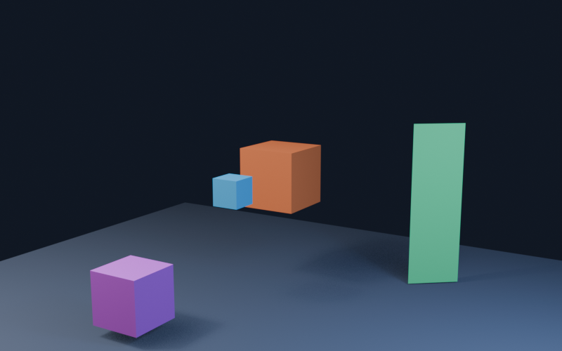
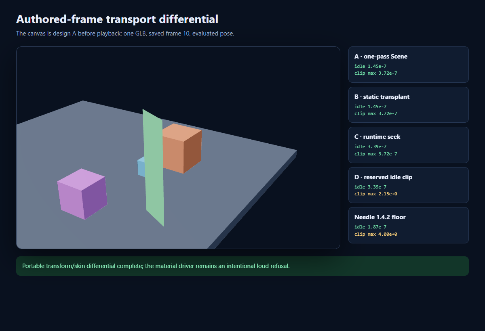

# Authored current-frame and default-pose transport

Status: **Prototype**, not shipped behavior  
Last differential pass: **2026-07-25**

## Decision summary

Blendlink should not globally switch its animation export to either
`export_rest_position_armature=false` or Blender's `SCENE` mode yet.

The smallest high-confidence production direction is a package-owned,
one-sample **authored presentation clip**:

- keep the armature's normal rest bind and the artist's named Actions;
- capture the saved frame's evaluated local TRS for only the nodes/bones whose
  idle state differs;
- apply that reserved clip while the scene is idle and after a clip stops;
- stop applying it before application-selected Actions play; and
- refuse unsupported driven channels or Action-dependent evaluated motion until
  their playback grouping has its own differential evidence.

The focused fixture proves this design restores the saved object, constrained
camera, driver, and skinned pose with maximum portable error
`3.386e-7`, while retaining `CameraMotion`, `RigMotion`, and `TargetMotion`.
It also proves the limitation: playing those three Actions alone still omits
the unkeyed follower and transform-driven object (`2.154` maximum error).
Therefore the presentation clip is a truthful default/idle-state improvement,
not a claim of complete constraint/driver animation transport.

For an explicitly whole-scene sequence, stable-rest `SCENE` export plus a
runtime seek to the authored frame is exact in this fixture and is a credible
future opt-in. It should not silently replace an Action library because it
collapses the developer-facing clip names into one scene clip.

## Primary sources and pinned identity

### Blender 5.2 documentation

The user-provided
[Blender 5.2 glTF manual](https://docs.blender.org/manual/en/5.2/addons/import_export/scene_gltf2.html)
is the correct public contract:

- **Use Current Frame as Object Rest Transformations** exports the current
  frame; when disabled, frame 0 supplies object rest transforms.
- **Use Rest Position Armature** uses the armature rest position; when
  disabled, the current pose supplies the joint rest pose.
- **Bake All Objects Animations** is intended for objects affected by
  constraints or drivers.
- `ACTIONS` preserves action-oriented clips; `SCENE` exports the evaluated
  scene as one baked animation.
- portable core animation is object transforms, pose bones, and shape-key
  values. Other animated properties require another supported transport.

The manual is the interface contract. The installed source and differential
below establish exact 5.2.39 behavior.

### Installed Blender glTF exporter

Installed root:

```text
C:/Program Files/Blender Foundation/Blender 5.2/5.2/scripts/addons_core/io_scene_gltf2
```

| Source | SHA-256 | Relevant behavior |
| --- | --- | --- |
| `__init__.py` | `0cd8903bd1a72ef1edbd728bee70d24a3ecc93c9901db68927b00910bb38be70` | option definitions and defaults |
| `blender/exp/export.py` | `28058857c3935162839da76d99aa8883e506cac066fb05cf2d611d96e66808bd` | frame selection and restoration around gather/write |
| `blender/exp/tree.py` | `a7cdaebf55836ce2cb466b7ab4f48a66490aacd2fc0cb45dcb0bcda8a18080f6` | rest-bone versus current-pose node matrices |
| `blender/exp/animation/action.py` | `569eac24187b664e73af3688140521a272122c09a96084d04974f64a8ea9c6f9` | Action collection and baked-object paths |
| `blender/exp/animation/anim_utils.py` | `79d7e7a3ddfe4ce4018d6b2ac21e9ee1710840954c8925e8d4005e0e231b6544` | object/bone sampling decisions |
| `blender/exp/animation/sampled/sampling_cache.py` | `9bbaca16da527310bcf9f54399618c36458c917ea83d32104d69adc1ec986142` | dependency-graph samples |

Blender 5.2.39 defaults observed from the operator RNA:

```json
{
  "export_animation_mode": "ACTIONS",
  "export_bake_animation": false,
  "export_current_frame": false,
  "export_force_sampling": true,
  "export_frame_step": 1,
  "export_pointer_animation": false,
  "export_rest_position_armature": true
}
```

`export.py` explicitly sets frame 0 when `gltf_current_frame` is false and
restores the prior frame only inside that false branch. The differential found
a concrete consequence not stated in the manual: `SCENE` sampling with
`export_current_frame=true` left the in-memory scene at frame 20. The prototype
transaction restored frame 10. The `.blend` remained byte- and timestamp-exact
(`b76b47c...` before and after), but any production use of this combination
must own frame/subframe restoration.

### Needle baseline

Inspected add-on: **Needle Engine Exporter for Blender 1.4.2**

```text
C:/Users/micha/Documents/GitHub/MichaelRoweJonesSite/.cache/needle-spike/addon/
Needle Engine Exporter for Blender/blender_export.py
SHA-256 6272997cfb4f1d740ea33a7c2512983b9993dedf93c9c8240ca0ff7f82925d77
```

Its ordinary export call passes none of `export_current_frame`,
`export_rest_position_armature`, `export_animation_mode`,
`export_force_sampling`, `export_bake_animation`, `export_frame_step`, or
`export_pointer_animation`. On Blender 5.2.39 it therefore inherits frame 0,
armature rest, Actions, forced sampling, and no bake-all.

The exact fixture result is a shared baseline gap, not positive parity:

- the GLB initially matches frame 0 rather than the saved frame 10;
- it emits `CameraMotion`, `RigMotion`, and `TargetMotion`;
- it has no channel for `ConstrainedCube` or `DrivenCube`;
- at frame 20 its maximum portable error is `4.0`.

Blendlink should improve on this by refusing unsupported evaluated animation
instead of publishing a healthy-looking partial clip set.

## Differential fixture

The prototype lives at
`experiments/authored-frame-transport-prototype`. Its one-command seam is:

```powershell
node experiments/authored-frame-transport-prototype/run.mjs
```

The command generates a source `.blend`, evaluates Blender oracle states,
exports every design, loads the GLBs in Chrome through Three's `GLTFLoader`,
plays clips, compares world transforms/camera forward vectors/skinned world
points, renders a nonblank image, and verifies disposal. Expected values come
from Blender's dependency graph, not from reimplementing exporter math.

Toolchain:

- Blender `5.2.0 LTS`, build `fbe6228777e7`;
- glTF exporter `5.2.39`;
- Three `0.184.0`;
- Vite `7.3.6`;
- Playwright `1.60.0`;
- Chrome `150.0.7871.182`.

Portable errors include constrained-object position, driven-object position,
camera position, camera forward angle, and a bidirectional world-space
Hausdorff distance over skinned vertices. The pass threshold is `7e-4`.
Material roughness is reported separately because its failure is intentional
and must remain loud.





## Designs compared

| Design | Default/idle | Clip playback | Artifact/interface cost | Verdict |
| --- | ---: | ---: | --- | --- |
| **A. One pass:** current frame + current armature pose + `SCENE` | `1.451e-7` | `3.720e-7` | one 13,376-byte GLB; collapses Actions to `AuthoredFrameTransport`; needs explicit Blender state transaction | Exact focused transport, but not a safe global default because it changes bind/clip semantics and loses Action names |
| **B. Dynamic GLB + static-current GLB transplant** | `1.451e-7` | `3.720e-7` | 13,324 + 9,500 bytes; two closures/hashes/loads; stable-name hierarchy transplant | Exact but shallow and expensive; reject |
| **C. Stable-rest `SCENE` GLB + runtime seek** | `3.386e-7` | `3.720e-7` | one 13,324-byte GLB; runtime must start and coordinate the whole-scene clip at frame 10 | Strong explicit whole-scene-sequence option; not an Action-library default |
| **D. Stable rest + named Actions + reserved one-sample idle clip** | `3.386e-7`; same after stop/reapply | named Action playback is red at `2.154` for follower/driver | three authored clip names retained; prototype presentation clip is 36 tracks / 3,363 JSON bytes before minimizing unchanged nodes | Recommended smallest default-state seam, with a loud playback limitation |
| **Diagnostic E. Current pose + Actions + Bake All Objects** | `1.451e-7` | `3.720e-7` only when all five clips play together | adds `ConstrainedCube` and `DrivenCube` clips beside the three authored Actions | Not automatic: `TargetMotion` alone no longer implies its follower, and stock output carries no coordination map |

### Why B is rejected

B proves that node-TRS transplantation can work, including this skin, but it
makes application loading understand two scene artifacts, a name/hierarchy
join, duplicate caching and cancellation, and two dependency closures. Deleting
that module would spread complexity across every adapter. Its interface is
larger than the behavior it earns.

### Why A is not the default

A is the most visually complete single-GLB result in this focused fixture. It
also changes two independent contracts:

1. the saved pose becomes the skin bind rather than preserving the authored
   armature rest; and
2. all developer-facing Actions become one scene clip.

It additionally exposed an in-memory frame-restoration bug in the unwrapped
stock call. A can be a deliberate whole-scene-sequence transport after broader
rig/NLA evidence, but it should not silently replace the current Action
library.

### Why C remains an opt-in

C keeps a conventional rest bind and achieves exact evaluated motion. It is
the cleanest representation when the artist intends one authored timeline.
However, the website would have to start and seek the generated scene clip
just to obtain the initial pose. Blendlink would also have replaced multiple
named Actions with one sequence. That is truthful only as an explicit
whole-scene playback policy.

### Why D is the smallest high-confidence change

D places a deep module at the presentation/playback seam:

```text
compile: evaluated saved frame -> reserved one-sample presentation clip
runtime: idle/start/stop policy -> apply or release that clip
```

The website still selects and owns ordinary playback. Callers need only know
that an installed scene has a package-owned idle pose; they do not load a
second GLB, match hierarchies, or seek a hidden full animation.

D is intentionally narrow. The fixture proves it cannot make an Action include
motion that Blender did not put in that Action. Blendlink must either:

- refuse that animated dependency with the affected object/constraint/driver
  names; or
- later compile verified package-owned companion tracks plus an attested
  grouping map so selecting `TargetMotion` also selects its evaluated
  dependents.

Until that grouping seam is evidenced, an exact idle pose is **Prototype** and
constraint/driver playback remains a **Gap**, not a shipped parity claim.

## Loud unsupported-driver evidence

The fixture drives `DrivenCubeMaterial -> Principled BSDF -> Roughness` through
an animated custom property. Blender evaluates:

```text
frame 0: 0.15
frame 10: 0.55
frame 20: 0.90
```

Core glTF without `KHR_animation_pointer` carries `0.55` at all three times.
Every generated GLB is verified to omit that extension. The prototype
preflight resolves Blender's numeric socket RNA path back to the UI name and
emits:

```text
animation.material-driver-not-portable
DrivenCubeMaterial: driver
nodes["Principled BSDF"].inputs["Roughness"].default_value
cannot be transported by core glTF animation.
```

This is the required behavior for any channel outside the chosen transport:
name the owner and artist-visible property, explain why it cannot ship, and
offer only verified remedies.

## Required production attestation

Before D can move from Prototype to Shipped, the compiled result should attest:

1. source `.blend` SHA-256, Blender build, exporter version/source identity,
   scene, saved frame and subframe, FPS, and frame range;
2. before/after source hash plus in-memory frame/subframe, active Actions/NLA
   state, pose state, selection, active object, and mode restoration;
3. the reserved clip name, collision check, content hash, stable target IDs,
   final glTF node indices, parent IDs, local TRS values, and the reason each
   target differs from ordinary idle;
4. for bones, skin index, joint index, armature stable ID, and inverse-bind
   accessor hash; never identify a bone only by display name;
5. constraint and driver inventory with one of:
   presentation-only capture, verified Action companion, supported pointer
   transport, or blocking diagnostic;
6. all developer clip names, source Actions/NLA tracks, target-channel sets,
   timing/range policy, and any package-owned companion grouping;
7. final GLB hash and the presentation payload hash after optimization; and
8. browser evidence that load -> idle -> play -> stop -> idle restores the
   exact presentation without leaking a second mixer/action or overriding an
   application-selected clip.

The compiler should minimize the reserved clip to changed targets rather than
copying the prototype's 36 tracks. A one-sample clip with unchanged nodes is
evidence scaffolding, not a payload target.

## Limits and future fixtures

This prototype covers one armature/bone, linear keyed motion, Copy Location,
Track To, one object transform driver, and one unsupported material driver. It
does not establish:

- multiple armatures or shared skins;
- NLA strip blending, muted/solo tracks, negative frames, or Action slots;
- constraints with dependency cycles or external/library-linked targets;
- shape-key current values and shape-key drivers;
- non-uniform/negative-scale armature parents;
- collection/geometry-node instances or renamed stable-ID recovery;
- retargeted/external Actions against a current-pose bind;
- `KHR_animation_pointer`; or
- runtime coordination across independently selected Action companions.

Those need small fixtures that can independently fail D, the SCENE option, and
Needle's baseline before any broader claim is recorded in
`TECHNIQUE_LEDGER.md` or `FEATURE_PARITY.md`.
