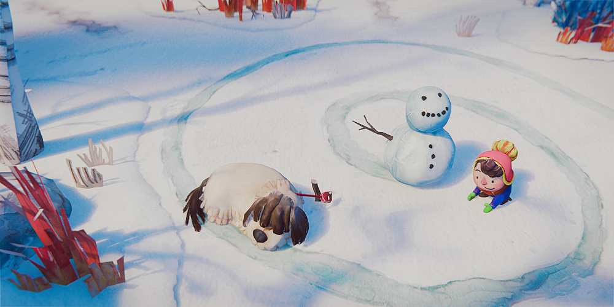
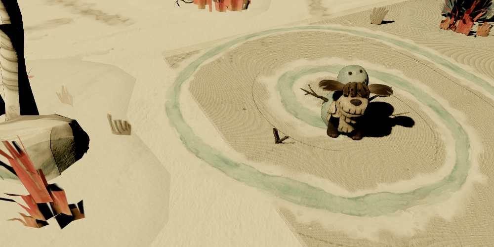
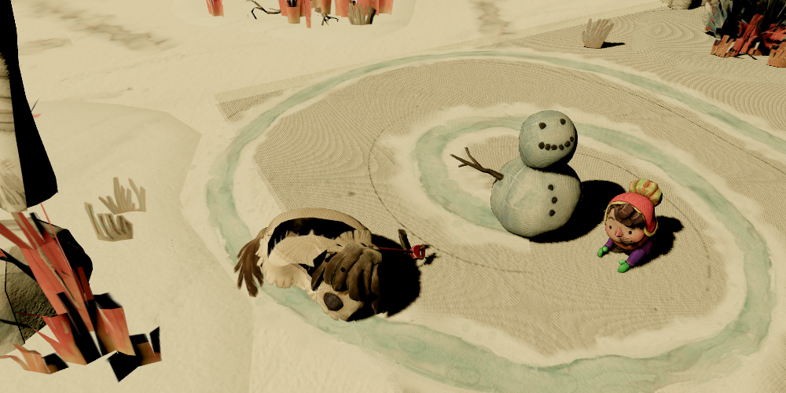

# Blender 4.5 DOGWALK zero-configuration audit (2026)

Status: **Research complete; transport controls are prototypes; no production
behavior changed.**

This note audits the untouched official Blender 4.5 DOGWALK splash source at
`C:/Users/micha/Downloads/blender-4.5-splash.blend`. The purpose is to find
general compiler gaps, not configure one demo until it happens to look right.
All generated derivatives stay local because the exact upstream license
variant has not yet been pinned from an immutable acquisition record.

## Conclusion

DOGWALK is an excellent high-complexity corpus scene. It exercises a distinct
combination that the existing demos do not:

- a single authored Eevee still at frame 85;
- constrained/driven camera evaluation;
- five armatures and 28 armature modifiers;
- 52 actions, 131 drivers, and one NLA stash;
- collection instances, curves, Geometry Nodes, packed images, and alpha;
- stylized nested material groups and an enabled compositor.

Stock glTF, including the exact stock-export settings delegated to by pinned
Needle 1.4.2, is not a visually valid result:

1. the exporter samples frame 0 unless `export_current_frame=true`;
2. the authored camera therefore moves;
3. even with the current camera frame, armatures remain in rest pose unless
   `export_rest_position_armature=false`;
4. nested stylized materials lose parts of their active surface response;
5. Blender compositor, world response, DOF, and Eevee screen-space lighting do
   not become ordinary glTF state.

Blendlink does **not** silently publish that floor. The untouched Final planner
exits 1 with 22 named `material.used-needs-bake` errors. The actual Final
compile exits 1 even earlier because animated/driven `CAM-Camera` data would
need `KHR_animation_pointer`, which the standard Three integration does not
bind. Both checks leave the source bytes unchanged.

The most valuable new compiler direction is an authored-still transport policy:
when the render range intentionally collapses to one frame, Blendlink should be
able to transport that evaluated camera and pose without deleting separately
authored actions. This remains a **Prototype**, because current-pose export with
retained clips has not yet passed action-playback differentials.

## Identity and primary-source baseline

Source:

- bytes: `401947045`
- SHA-256:
  `7f8718cfd89baf59151cc4ba431eeab38b9ff260ffa0054d93293f228a70cc36`
- current/start/end frame: `85/85/85`
- render engine: Eevee
- output after render percentage: `1000x500`

Toolchain:

- Blender `5.2.0 LTS`, build `fbe6228777e7`, 2026-07-14
- installed Khronos glTF Blender I/O `5.2.39`
- installed `io_scene_gltf2/__init__.py` SHA-256:
  `0cd8903bd1a72ef1edbd728bee70d24a3ecc93c9901db68927b00910bb38be70`
- installed `blender/exp/export.py` SHA-256:
  `28058857c3935162839da76d99aa8883e506cac066fb05cf2d611d96e66808bd`
- Three `0.184.0`

The [Blender 5.2 glTF add-on manual][blender-manual] supplied by the maintainer
is useful as the supported-format contract: it documents ordinary mesh,
recognized material, camera, punctual-light, extras, and animation transport,
and explicitly narrows animation support to transforms, bones, and shape keys.
For this differential, the installed source is the behavioral truth.
`blender/exp/export.py:27-29` stores the original frame and sets frame 0 when
`gltf_current_frame` is false. Blender's operator defaults also leave
`export_rest_position_armature` true.

Pinned Needle:

- add-on version `1.4.2`
- normalized source path `blender_export.py`
- SHA-256:
  `6272997cfb4f1d740ea33a7c2512983b9993dedf93c9c8240ca0ff7f82925d77`
- audited settings: source lines 374-416

Needle delegates its ordinary path to Blender's stock GLB exporter with
cameras, lights, active scene, `export_apply=true`, animations, visible false,
AUTO images, and quality 100. It does not set `export_current_frame` or
`export_rest_position_armature`; Blender defaults therefore apply. This is only
a **Needle-equivalent stock core floor**, not a coherent Needle runtime or
browser result.

[blender-manual]: https://docs.blender.org/manual/en/5.2/addons/scene_gltf2.html

## Untouched source inventory

The source opens with auto-execution disabled and remains byte-identical after
every probe.

| Family | Authored | Evaluated/export-relevant result |
| --- | ---: | --- |
| Objects | 185 | 445 depsgraph entries: 179 real, 266 instances |
| Meshes | 90 | 158 evaluated mesh instances |
| Curves | 7 | all seven evaluate to meshes |
| Collection-instance empties | 39 | preserved through evaluated expansion |
| Geometry Nodes modifiers | 9 | static/no simulation; seven curve/GN objects produce geometry |
| Armatures | 5 | 591 bones total; 28 armature modifiers |
| Actions | 52 | 47 active owners; 41 stock glTF clips |
| Drivers | 131 | camera/rig constraint and data control |
| Materials | 43 | 27 emitted by stock glTF |
| Images | 73 | 70 packed |
| Lights | 2 | both Suns |

The source camera uses Copy Transforms from `RIG-Camera`, is perspective with
DOF enabled, and has data drivers. The compositor contains blur, glare, curves,
hue/saturation, lens distortion, and mask operations. None of those facts can
be inferred from a superficially successful GLB load.

Full machine-readable inventory:
[source-inventory.json](../experiments/dogwalk-zero-config-audit/output/source-inventory.json).

## Needle/stock structural floor

The exact pinned Needle stock settings produce:

- GLB bytes: `198441264`
- SHA-256:
  `1bf935c8f4edb8906c73014694c928c27b3f186bf0c3351c86ba3ff730ae7525`
- 1,231 nodes, 265 meshes, 266 primitives
- 27 materials, 33 embedded images, 53 texture definitions
- one camera, two lights, five skins
- 41 animations and 1,834 channels

This proves substantial structural transport. It does **not** prove visual
parity. The raw Three render never creates an `AnimationMixer` and plays zero
actions, yet its camera is at
`[-1.1296052933, 4.7099080086, 6.1240653992]`, not the authored frame-85
position. Pinda's geometry is not omitted: the GLB contains all 13 named Pinda
meshes, 10 skinned meshes, and a 215-joint skin, and every mesh is visible.
The rig is simply exported at its rest state near the origin.





## Frame and pose differential

Three independent controls separate the failure:

| Control | Export settings changed | Camera | Pinda/Chocomel pose | Clips | Classification |
| --- | --- | --- | --- | ---: | --- |
| Stock/Needle core floor | none | frame 0 | rest | 41 | Research floor |
| Current frame only | `export_current_frame=true`, animations false | exact frame 85 | rest | 0 | Prototype |
| Current pose | above plus `export_rest_position_armature=false` | exact frame 85 | authored pose | 0 | Prototype |
| Current pose + actions | both flags plus animations true | exact frame 85 | authored pose | 41 | Prototype |

The current-frame-only control proves the camera and armature failures are
separate. Current pose moves Pinda's browser bounds center from approximately
`[0, 0.508, -0.096]` to `[0.981, 0.406, 0.384]` and recovers the intended
Pinda, Chocomel, dog, and snowman composition.

Keeping animations adds the same 41 clips and 1,834 channels as the stock
floor. With no action played, its screenshot is byte-identical to the static
current-pose control:
`ae82e5539c735c3c98fd019c14848eaff81c2d39cf19c2945564de3c2c39d1c3`.
That proves structural clip retention and an unchanged initial render only. It
does **not** prove that every retained action plays correctly relative to the
new armature rest basis.



Exact camera comparison converts the evaluated Blender matrix to glTF Y-up
coordinates with the basis `(x, y, z) -> (x, z, -y)`.

- maximum world-matrix absolute error: `5.523546342534047e-8`
- maximum projection-matrix absolute error:
  `1.076133711030991e-7`

Evidence:
[camera-matrix-differential.json](../experiments/dogwalk-zero-config-audit/output/camera-matrix-differential.json).

## Material, lighting, and filtering isolation

The current-pose control still fails visual parity. It is too beige, loses the
blue Eevee shadow response, lacks compositor/DOF effects, and contains very dark
left-edge geometry.

Disabling Three shadow maps removes the added hard shadows but does not remove
the black slabs. Hiding all three exported `LGT-shadow_caster*` meshes produces
an identical PNG SHA-256 to the shadow-disabled baseline:
`03098d3d998885d726e024d1b185874d455ddfa4eb7154b71898d87e4708ac49`.
Those proxies are not the visible defect in this camera.

The source proxy material is nevertheless nonportable: its Principled Alpha is
linked from an Attribute node and uses DITHERED rendering, while stock glTF
emits a BLEND material with constant factor alpha 1. Blendlink correctly names
that material as `material.used-needs-bake`.

A 25-pixel browser raycast sample of near-black pixels instead identifies:

1. `GEO-birch_tree_005_unfolded [birch_tree]` — 12 samples;
2. `GEO-dogwood_004 [dogwood]` — 4;
3. `GEO-boulder_002 [boulder_cut]` — 3;
4. smaller legitimate dark character/foliage regions.

The first three materials use nested stylized node groups. Stock glTF preserves
some image slots but not their complete active surface/alpha response. This
matches the planner's refusal and is stronger evidence than guessing from the
screen shape.

Three r184 gives every loaded texture anisotropy 1 by default
(`src/textures/Texture.js`, SHA-256
`ab2b297f91c58c69a95849ef8d1d3a9b7c0e7d2c3a574964b0ffd90b107452c6`).
The WebGL source caps requested anisotropy against the device maximum
(`src/renderers/webgl/WebGLTextures.js`, SHA-256
`2508f0bb491c4d7121e76fc3a4fbcfb769b76d7e2ac8f2392f3c7957ce946e6c`).
A separate control sets all 46 observed textures from 1 to the SwiftShader
maximum 16 and changes the screenshot SHA-256 to
`8f8974be027d725f02a9080e53f9af8aee7c5d1ff8d57ee20839bf2c81193258`.
It visibly reduces some oblique ground shimmer, but does not fix material,
lighting, or color response. This is a **Prototype**, not physical-GPU
performance evidence and not a recommendation to maximize every texture
unconditionally.

## Untouched Blendlink result

The Final planner command exits 1, returns `plan: null`, and reports 22
material errors, all code `material.used-needs-bake`. The errors name exact
materials, users, and unsupported graph reasons. Representative families are
birch, dogwood, Pinda, Chocomel, snowman, grass, leash, boulder, alpha proxies,
and roots.

The actual Final compile also exits 1, before generating an artifact:

> Property animation blocked (standard Three.js does not bind
> KHR_animation_pointer): CAM-Camera: camera data values are animated or driven

The compile evidence records the same source SHA before and after. The
publication lease requires normal per-user cache access; the first sandbox-only
attempt was discarded and the evidence file contains the real rerun.

Evidence:

- [blendlink-plan-evidence.json](../experiments/dogwalk-zero-config-audit/output/blendlink-plan-evidence.json)
- [blendlink-compile-evidence.json](../experiments/dogwalk-zero-config-audit/output/blendlink-compile-evidence.json)

## Designs considered

### A. Keep stock/Needle exporter defaults

Rejected for authored stills. It is simple and structurally rich, but it samples
the wrong frame and rest pose here. A successful GLB load would be actively
misleading.

### B. Always export current frame and current armature pose

Rejected as a global default. It fixes DOGWALK's still composition, but could
change the basis expected by real animation-first scenes. Structural clip
retention is verified; action playback equivalence is not.

### C. Infer a narrow authored-still policy, preserve actions, and prove them

Recommended for the next differential. A scene with a deliberately collapsed
render range is strong Blender-authored intent for one visible frame. Blendlink
can select current camera/current pose for that presentation while retaining
actions as developer-accessible clips. Before shipping:

1. create a tiny constrained-camera + armature fixture with a one-frame render
   range and separately useful actions;
2. compare initial pixels and camera matrices;
3. play named actions and compare sampled bone/object transforms against
   Blender;
4. keep property-animation refusal loud where standard Three has no binding;
5. expose the inferred decision in diagnostics rather than silently changing
   exporter semantics.

This fits Blendlink's product boundary: Blender owns presentation intent;
Blendlink compiles it; the website still owns when developer-facing clips play.

## Capability register

| ID | Needle baseline | Blendlink status | Relation | Evidence |
| --- | --- | --- | --- | --- |
| `NDL-DOG-001` | Needle 1.4.2 delegates current-frame/rest-pose defaults to stock glTF | Current Blendlink compile refuses this source before emitting the misleading floor | **Improvement**, **Shipped diagnostic** | plan/compile evidence above, 2026-07-25 |
| `NDL-DOG-002` | No current-frame/current-pose override in the audited Needle export call | Narrow authored-still inference is designed but not shipped | **Improvement candidate**, **Prototype** | four-way frame/pose GLB and browser differential |
| `NDL-DOG-003` | Stock path emits incomplete stylized group response | Blendlink names 22 used materials and blocks | **Improvement**, **Shipped diagnostic** | untouched Final planner, exit 1 |
| `NDL-DOG-004` | Coherent Needle runtime visual result not executed | No visual parity claim | **Gap / Pending** | stock-core floor only |
| `NDL-DOG-005` | Needle texture anisotropy behavior not audited for this scene | Three 1→16 control changes oblique sampling | **Unaudited**, **Prototype** | paired browser evidence; physical GPU pending |

## Commands

Run from the repository root unless a command changes directory:

```powershell
npm.cmd run verify:needle-baseline

& 'C:\Program Files\Blender Foundation\Blender 5.2\blender.exe' `
  --background 'C:\Users\micha\Downloads\blender-4.5-splash.blend' `
  --disable-autoexec `
  --python experiments\dogwalk-zero-config-audit\inspect_source.py -- `
  experiments\dogwalk-zero-config-audit\output\source-inventory.json `
  experiments\dogwalk-zero-config-audit\output\blender-eevee-authored-0085.png

& 'C:\Program Files\Blender Foundation\Blender 5.2\blender.exe' `
  --background 'C:\Users\micha\Downloads\blender-4.5-splash.blend' `
  --disable-autoexec `
  --python experiments\dogwalk-zero-config-audit\inspect_camera.py -- `
  experiments\dogwalk-zero-config-audit\output\source-camera-evidence.json

& 'C:\Program Files\Blender Foundation\Blender 5.2\blender.exe' `
  --background 'C:\Users\micha\Downloads\blender-4.5-splash.blend' `
  --disable-autoexec `
  --python experiments\dogwalk-zero-config-audit\inspect_shadow_casters.py -- `
  experiments\dogwalk-zero-config-audit\output\source-shadow-caster-evidence.json

# export_stock_floor.py accepts: no mode (Needle core floor),
# static-current-frame, static-current-pose, or current-pose-with-animations.
& 'C:\Program Files\Blender Foundation\Blender 5.2\blender.exe' `
  --background 'C:\Users\micha\Downloads\blender-4.5-splash.blend' `
  --disable-autoexec `
  --python experiments\dogwalk-zero-config-audit\export_stock_floor.py -- `
  experiments\dogwalk-zero-config-audit\output\current-pose-with-animations-prototype.glb `
  experiments\dogwalk-zero-config-audit\output\current-pose-with-animations-export-evidence.json `
  current-pose-with-animations

node experiments\dogwalk-zero-config-audit\inspect_glb.mjs `
  experiments\dogwalk-zero-config-audit\output\current-pose-with-animations-prototype.glb `
  experiments\dogwalk-zero-config-audit\output\current-pose-with-animations-glb-report.json

node experiments\dogwalk-zero-config-audit\run_browser.mjs stock-floor
node experiments\dogwalk-zero-config-audit\run_browser.mjs static-current-frame
node experiments\dogwalk-zero-config-audit\run_browser.mjs static-current-pose
node experiments\dogwalk-zero-config-audit\run_browser.mjs current-pose-with-animations
node experiments\dogwalk-zero-config-audit\run_browser.mjs current-pose-shadows-off
node experiments\dogwalk-zero-config-audit\run_browser.mjs current-pose-hide-shadow-casters
node experiments\dogwalk-zero-config-audit\run_browser.mjs current-pose-anisotropy-max
node experiments\dogwalk-zero-config-audit\compare_camera.mjs

Push-Location experiments\dogwalk-zero-config-audit
node run_blendlink_plan.mjs
node run_blendlink_compile.mjs
Pop-Location
```

The compile command needs normal Blendlink publication-lease access under the
user cache. Browser runs use Chrome 150/WebGL2 through SwiftShader and are
correctness evidence, not physical-GPU timing evidence.
