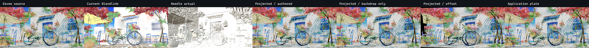
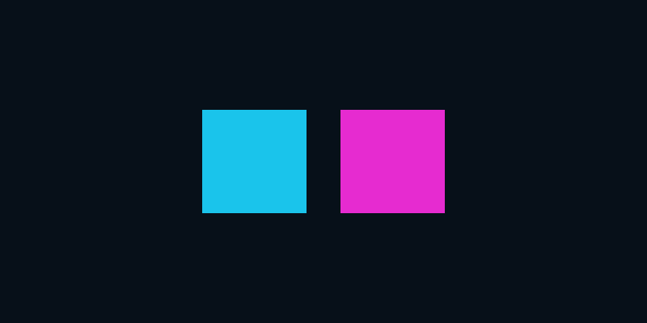

# Eevee fixed-camera appearance transport, 2026

- Research date: 2026-07-24
- Scope: a bounded, artist-first fallback for static scenes whose authoritative
  Eevee result cannot be represented by stock glTF materials
- Primary fixture: Blender 4 Splash selected-sky derivative
- Production changes: one internal package-owned Three runtime primitive and
  focused tests; no manifest/schema, public export, compiler capture, or
  automatic runtime integration
- Prototype:
  [`experiments/eevee-fixed-camera-transport-prototype`](../experiments/eevee-fixed-camera-transport-prototype/)

## Outcome

A final, display-referred Eevee frame can be projected through its exact
authored glTF camera onto the retained Splash geometry and reproduce the
1200 by 600 reference essentially exactly:

- normalized whole-frame MAE: `0.000001`;
- root-mean-square error: `0.000079`;
- changed channel fraction above 8/255: `0`;
- shadow semantic gate: pass;
- sky semantic gate: pass; and
- building-pattern semantic gate: pass.

The same command compares the actual Needle browser result. Current Blendlink
has MAE `0.191306` and fails all three complete semantic gates. The bounded
Needle result has MAE `0.296973` and also fails all three. The projector is
therefore a **Prototype improvement** for this exact camera result, not a
general scene-parity claim.

Moving the website camera by only 1.5 scene units plus four degrees changes the
projected frame by MAE `0.180574` and visibly tears or stretches the captured
appearance. The contract must be named **fixed-camera appearance proxy**, not
portable material, light transport, or Eevee shader translation.



The overview SHA-256 is
`bafb80a5506c766bd6eae3625d38adb0cc9204733ca4ebe5ac66842e1e93369f`.

## Important falsification inside the green result

One projected `DP-SkyPaint` backdrop mesh, with the other 334 meshes hidden,
also reproduces the complete beauty frame and passes the three semantic gates.
It uses one draw call instead of 324. This proves that matching color pixels
does **not** prove that the beauty information belongs to the correct surface,
object, or depth.

The complete-geometry projector nevertheless has a separately verified depth
benefit. A red sphere placed 50 units along the center camera ray is:

- hidden by the full exported geometry, whose nearest center hit is at
  distance `36.56`; and
- visible when only the sky backdrop at distance `619.50` remains.

The complete projector also retains 335 loaded meshes and returns real center
ray intersections. It can therefore preserve depth testing and picking for
objects that actually survive export. It cannot create missing geometry or
identity.

That distinction matters for the newly reported missing flowerpot and lamp.
The beauty proxy preserves their **visible pixels**, even if it paints those
pixels onto the sky or another surviving surface. It does not preserve their
object IDs, transforms, bounds, depth, animation, raycast targets, or
components. Object completeness remains a separate compiler/export gate.

## Evidence status

### Verified in the disposable browser prototype

Run:

```powershell
npm.cmd --prefix experiments\eevee-fixed-camera-transport-prototype run verify
```

Last pass: 2026-07-24.

Toolchain:

- Node `24.15.0`, Windows x64;
- Chrome `150.0.7871.182`;
- Playwright `1.60.0`;
- Three `0.184.0`;
- WebGL 2; and
- exact 1200 by 600 authored perspective camera.

The command starts a private local server and captures:

1. the complete-geometry authored-camera projector;
2. the same projector with only the sky backdrop;
3. the projector after a camera move;
4. the two depth-probe controls;
5. raw glTF;
6. an application-owned image plate; and
7. the retained current Blendlink and actual Needle pixels.

The machine-readable evidence is
[`output/evidence.json`](../experiments/eevee-fixed-camera-transport-prototype/output/evidence.json).
It identifies every input and output image, browser failure list, camera,
mesh/draw/triangle counts, raycasts, semantic metrics, and the evidence
boundary.

### Not verified

- production compiler or runtime integration;
- camera-matrix enforcement over a website render loop;
- other cameras, frames, resolutions, or aspect ratios;
- animation, transforms, material/state changes, or visibility changes;
- alpha-blended, refractive, volumetric, holdout, or composited depth;
- WebGPU or React Three Fiber;
- cancellation, Suspense, retry, preload, or cache ownership;
- PNG/WebP/AVIF/KTX delivery quality and payload tradeoffs;
- a scene without full viewport surface coverage;
- multiple appearance cameras or transitions;
- exact picking/depth for the missing flowerpot or lamp; or
- performance. The retained first-frame timings are diagnostic only.

## Resolution hypothesis is ruled out

The independent Final-tier selected-field check raised the sky materialization
from 1024 to 2048 pixels. Its projected-density ratio is
`1.725147455818445`, and `densityMet` is `true`.

The result still fails every complete semantic gate:

| Measurement | Final 2048 result |
| --- | ---: |
| Shadow broad-band ratio | `0.268231` |
| Shadow luminance-range ratio | `0.154057` |
| Sky local-noise ratio | `1.845976` |
| Sky median-color error | `3.447755` reference spreads |
| Building luminance-detail ratio | `0.042990` |
| Building color-detail ratio | `0.040908` |
| Building reference-pattern correlation | `0.045046` |

The sky noise became worse, while shadow and building measurements stayed
effectively unchanged. Simple selected-field resolution is not the cause of
these three defects. The evidence lives under
[`experiments/splash-final-sky-density`](../experiments/splash-final-sky-density/);
its visual-gate JSON SHA-256 is
`5cb196fd4ed0e56d0d9d8c30edf2cef3e77d874fd09cbf3d496517326928b320`.

## Needle behavioral baseline

`npm.cmd run verify:needle-baseline` passed before this comparison:

```text
BLENDLINK_NEEDLE_BASELINE_VERIFIED 122 files, 7 source version identities (2026-07-24) integration=mixed-source named=splash-official-preview:coherent
```

The exact add-on is Needle Engine Exporter for Blender `1.4.2`. The clean
official Preview browser used the exact `@needle-tools/engine` `5.1.4` bundle
and Vite `8.0.3`. The complete identity and actual three-way result are
recorded in
[`research-splash-needle-three-way-visual-2026.md`](research-splash-needle-three-way-visual-2026.md).

Relevant exact sources:

| Source | SHA-256 | Observed behavior |
| --- | --- | --- |
| add-on `__init__.py` | `980226a628182e9e0b1d443c0e294f799162c76e06c5f599dacc20c614a8c96e` | add-on version `1.4.2` |
| add-on `blender_export.py` | `6272997cfb4f1d740ea33a7c2512983b9993dedf93c9c8240ca0ff7f82925d77` | delegates ordinary materials to Blender stock glTF with image format `AUTO` |
| add-on `panels_object.py` | `89dbb640ce3326915de768773e9ed7443a5f1778ed37b418437d757abff279ec` | `NEEDLE_isLightmapped` is explicit and defaults false |
| add-on `lightmapping/lightmapping.py` | `4e69f0934d9329b2d8480b097baa1d903aa31bed9337c7a2ae0630cbc900b4f1` | explicit selected-receiver combined lightmap bake |
| add-on `extensions/NEEDLE_lightmaps.py` | `3831dd545261fdd4fa5e5fca9ad98ae7912a0939ea2758bb737b74eae4376a77` | exports lightmap/environment metadata |
| Engine `RendererLightmap.ts` | `0c2b96f12d22dd000a0c92c185b1685cd48af72b8f5b8f8569f703be7e889bd7` | installs runtime `lightMap` overrides |
| Engine `Skybox.ts` | `ef981296e6ceaeb792feb8c433df7cd48740bacf090f77ea693e42cda86876b5` | environment/sky runtime, not a fixed-camera beauty proxy |

The inspected export, lightmap, renderer-lightmap, sky, postprocessing, and
camera-setting paths contain no automatic final-Eevee beauty capture or
camera-projected appearance transport. A targeted source search found only
reflection-probe render-result behavior, which is not analogous. This note
therefore records **No analogue in the inspected Needle families**, not a
claim about every Needle package or future version.

The actual Needle Splash artifact is:

- GLB SHA-256
  `ba66cf5c974bf5fb14740e42225de5030174e9ecbe2731d74b7ad0fb38660da9`;
- screenshot SHA-256
  `54e30ecaa0342611122288efbf6ffe9c7440709d6d613c67adf77d37fe0efcbc`;
- zero receiver lightmaps; and
- 35 ordinary authored materials with no retained base-color texture.

The fixture is recorded as
`integration:splash-official-preview=coherent`: its clean package tree,
official Preview host, exact asset graph, and browser smoke are verified. The
broad inventory remains `integration=mixed-source`, and the licensed production
transform is still Pending.

## Primary-source constraints

Blender defines rendering as turning the authored 3D scene into a 2D image,
with cameras, lights, materials, layers, passes, and compositing contributing
to the result. Capturing that final Eevee output is therefore authoritative
for a declared fixed image, but not evidence that its shading program was
translated.
[Blender rendering introduction](https://docs.blender.org/manual/en/2.90/render/introduction.html)

Shader to RGB is Eevee-only and evaluates BSDF lighting before producing a
color. It cannot be recovered by raising the resolution of an upstream
intrinsic-field bake.
[Blender Eevee supported nodes](https://docs.blender.org/manual/uk/5.0/render/eevee/limitations/nodes_support.html)

glTF defines the camera projection and node-derived view matrix, giving the
projector an interoperable camera seam. The specification does not define a
final-camera beauty plate as a standard material.
[Khronos glTF camera model](https://registry.khronos.org/glTF/specs/2.0/glTF-2.0.html#cameras)

Three exposes `Camera.matrixWorldInverse` and `projectionMatrix`, and its
`ShaderMaterial` receives built-in transforms plus custom uniforms. Those are
the exact installed r184 mechanisms used by the prototype.
[Three Camera](https://threejs.org/docs/pages/Camera.html),
[Three ShaderMaterial](https://threejs.org/docs/pages/ShaderMaterial.html)

Installed Three identities:

| Source | SHA-256 |
| --- | --- |
| `node_modules/three/package.json` | `8308e43d6d6dd4c636c2dfe2e724da07dcd9fe4349bba6afb56f2c5ba6625391` |
| `src/materials/ShaderMaterial.js` | `a935827f12873ba7310744dd8ae659bcf772dea4bdddf0eac23ca88bc0859c6d` |
| `src/cameras/Camera.js` | `8a9cf79c111465425fc176d5f20d2f37a5640c2bdf4f58701db1f6e64e46bb01` |
| `examples/jsm/loaders/GLTFLoader.js` | `97642d720f16cc9a0c9844934198e4d0c023bea8e89576d0f7545d03b2d103d2` |

## Designs compared

### Design A — application-owned final plate

Ship the final Eevee color image as an ordinary application asset. The website
decides whether and where to render it.

**Strengths**

- Exact at its captured size/aspect.
- Smallest interface and implementation.
- Preserves the complete visible frame, including unsupported materials,
  shadows, outlines, color management, compositor output, and pixels for
  objects omitted from glTF.
- Keeps route, layout, loading UI, analytics, and deployment application-owned.

**Limits**

- It is a 2D image, not a 3D scene.
- It has no object identity, depth, picking, parallax, or 3D occlusion.
- A Canvas overlay must choose whether new 3D content is wholly in front of or
  behind it unless a separate depth representation is introduced.

**Decision:** keep as the exact reference/fallback and let the application own
presentation. Do not market it as Blendlink scene parity.

### Design B — fixed-camera geometry projector

Load the ordinary glTF, retain the authored camera and geometry, replace
visible materials with one display-referred texture sampled through:

```text
projector = authoredProjection * inverse(authoredCameraWorld)
projectedUv = perspectiveDivide(projector * objectWorldPosition)
```

The application still owns its Canvas and loop. Blendlink would own a
transactional material lease that validates invariants and restores the
application materials on disposal.

**Strengths**

- Essentially exact Splash color at the declared camera.
- Retains depth testing and raycasts for exported geometry.
- One shared unlit texture/material can avoid realtime lights, shadow maps,
  custom Eevee shader translation, and the current atlas-resolution failure.
- Preserves unsupported final-frame effects without using Cycles, so Eevee
  remains source truth.
- The existing 1200 by 600 PNG is 1,557,560 bytes before delivery
  optimization—far smaller than the 38.9 MB selected-field GLB, although no
  production payload claim is made yet.

**Limits**

- Camera, aspect, frame, transforms, deformation, visibility, and compositing
  order are frozen.
- Highlights, shadows, outlines, transparency, and the missing flowerpot/lamp
  are view-dependent color, not semantic surface data.
- Missing geometry still has missing depth and interaction.
- A full-screen backdrop can produce the same pixels, so visual equality alone
  cannot attest per-surface correctness.
- It needs a loud mismatch policy. Rendering a smeared offset view is
  unacceptable.

**Decision:** recommended for one more focused prototype as an explicit
fixed-camera appearance proxy. It is not ready for a production manifest or
runtime interface.

### Design C — intrinsic material plus lighting/shadow layers

Materialize portable intrinsic fields, then use live Three lighting or a UV
lightmap/shadow layer.

**Strengths**

- Camera-independent for static receivers.
- Can preserve developer-owned camera movement and some interaction.
- Stock glTF/PBR plus standard lightmaps has broad runtime interoperability.
- Needle has an explicit selected-receiver lightmap analogue.

**Limits**

- The Splash active surfaces contain Shader to RGB, AO, multiple vertex/image
  fields, view dependence, outlines, and compositor effects.
- Decomposing arbitrary Eevee appearance into albedo, light, shadow, and
  postprocessing is not exact.
- Atlas UVs, texel density, seams, alpha, and multiple layers add payload and
  bake complexity.
- The 2048 density control already proves that resolution alone does not fix
  this scene.

**Decision:** remain the general default for camera-moving static scenes, with
the material-compiler and shadow improvements tracked elsewhere. It is not the
shortest exact route for this fixed Splash hero.

### Design D — application plate plus depth/ID companions

Ship final color plus Eevee depth and optionally object/material ID passes.
Render the plate in Canvas with a depth representation, while retaining glTF or
an ID map for interaction.

**Strengths**

- Could preserve final color and source depth even where glTF omits geometry.
- More honest than pretending the beauty frame is per-surface material.

**Limits**

- Depth through transparency, volumes, outlines, motion blur, and compositor
  effects is not a single well-defined layer.
- Object-ID companions create new asset, encoding, filtering, and interaction
  contracts.
- It begins to resemble a view-dependent rendering package rather than an
  ordinary Three scene.

**Decision:** future experiment only. Do not add ID/depth schemas until a
two-object transparency/occlusion fixture demonstrates clear leverage over the
geometry projector.

## Recommended deep module and seam

If the next prototype remains green, the compiler should expose one small
internal planning interface:

```ts
type FixedCameraAppearancePlan =
  | {
      kind: "projected-color";
      cameraId: string;
      frame: number;
      width: number;
      height: number;
      colorAsset: string;
      cameraFingerprint: string;
      sceneStateFingerprint: string;
    }
  | {
      kind: "refused";
      reasons: readonly string[];
    };
```

The plan is illustrative, not a manifest proposal. Its interface states the
few facts callers need; the module implementation would hide:

- Eevee render transaction and state restoration;
- display-referred color handling;
- camera and scene-state fingerprinting;
- complete asset-graph addressing;
- GPU texture preparation;
- material replacement/restoration;
- shared material ownership;
- mismatch detection; and
- artist-readable diagnostics.

At the Three seam, one adapter could accept the website-owned scene, renderer,
and exact authored camera and return a disposable lease:

```ts
prepareFixedCameraAppearance(options): Promise<{
  validate(): "valid" | "camera-changed" | "scene-changed";
  dispose(): void;
}>;
```

The website still chooses when to activate it, what to show while it loads,
whether to retry, and whether to fall back to realtime or an application plate.
The module must never take over the route, Canvas, render loop, layout,
analytics, or deployment.

This would be a deep module because camera validation, capture color,
projection, ownership, and cleanup stay behind one small interface. Generated
bindings should remain tiny adapters.

## Required invariants before production

1. Eevee is the capture engine when Eevee is selected. No Cycles generalization
   is allowed.
2. The capture is explicitly final/display-referred and must not be tone-mapped
   again at runtime.
3. Camera world matrix, projection, aspect, frame, render border, and
   composition must match the attested capture.
4. Every projected receiver world transform, skin/morph pose, visibility, and
   relevant geometry fingerprint must match.
5. Animation, controls, LOD changes, component-driven transforms, and
   visibility changes either deactivate the proxy before mutation or are
   refused.
6. A mismatch is loud. It may switch to application-declared realtime/plate
   fallback, but must never continue with a visibly smeared projection.
7. Missing-object diagnostics remain visible. Pixel preservation cannot clear
   object-completeness failures.
8. The complete color asset belongs to the content-addressed scene graph and
   follows the same base-path/CDN/CORS/caching rules as the GLB.
9. A lease owns only materials/textures it installs and restores application
   state transactionally, including Strict Mode and late completion.
10. The canonical `bakelib.py` mechanics remain the only home for shared save,
    color, coverage, and bake primitives. No generated/site copy is allowed.

## Smallest next differential

Build a two-object Eevee fixture with:

- no full-screen sky mesh;
- an opaque foreground occluder;
- a transparent or dithered foreground surface;
- a background receiver;
- one object deliberately excluded from glTF;
- one application-added Three object;
- one fixed authored camera plus an offset-camera control;
- two aspect ratios; and
- a component that attempts one visibility or transform change.

It must independently turn red when:

1. the camera matrix changes;
2. the aspect changes without an approved crop/letterbox composition;
3. a projected receiver moves;
4. the missing object is incorrectly claimed as interactive;
5. the application object is composited at the wrong depth;
6. transparency has no truthful depth policy;
7. the texture is tone-mapped twice; or
8. disposal fails to restore the application material.

Only after that fixture passes should Blendlink consider a production module.
The Splash result alone is strong pixel evidence but too forgiving because its
sky geometry covers the full viewport.

## Surface-scoped package module follow-up

Capability `NDL-MAT-009` remains **No analogue / Prototype Improvement**.
Blendlink now has an internal package-owned Three module at
[`threeFixedCameraAppearance.ts`](../packages/blendlink/src/threeFixedCameraAppearance.ts),
but it is deliberately not exported from the package and is not called by the
compiled-scene installer.

The module's small interface installs an already-loaded, display-referred
capture on explicit receiver/material bindings and returns a disposable handle.
It owns validation, projection, material replacement, per-draw mismatch guards,
and conditional restoration. It does not load URLs, change renderer settings,
infer targets from names, take route/Canvas/render-loop ownership, or dispose
the caller's texture.

### Existing production audit

Blendlink's existing `fixedCameraAppearance` setting is not this transport. It
is an internal bake-policy fact derived only when the recipe has one fixed,
authored active camera and all atlases are Appearance. It:

- admits a narrow set of otherwise view-dependent opaque static materials into
  the existing UV-atlas Appearance bake;
- selects Blender's Active Camera bake-ray origin where supported; and
- keeps glass, transmission, animation, unsafe shader graphs, and explicit
  Realtime intent out.

The current manifest and generated descriptor publish no final-camera capture,
camera matrices, capture aspect/frame, surface binding, or capture asset.
[`bakelib.capture_fixed_camera_card()`](../packages/blendlink/blender/bakelib.py)
is also not the production path: no caller uses it, and its generated quad
replaces rather than preserves source geometry, depth, and raycast identity.

### Designs compared at the production seam

#### Design 1: generated camera card

Render the selected object with alpha, crop it, inverse-project the crop to a
quad, and export that quad. This reuses an existing canonical `bakelib.py`
primitive and produces a simple stock unlit material.

It is rejected for `NDL-MAT-009`: a card changes geometry, bounds, raycasts,
occlusion depth, object identity, and potentially component ownership. Its
single plane also cannot preserve self-occlusion across a non-planar receiver.
It remains useful only for an explicitly 2D proxy contract.

#### Design 2: retained-geometry projected material

Keep the exported receiver and replace only exact attested material bindings.
The unlit runtime material samples the capture with:

```text
projector = authoredProjection * inverse(authoredCameraWorld)
uv = perspectiveDivide(projector * receiverWorldPosition)
```

This is the selected prototype. It preserves mesh geometry, transform, depth
test/write behavior, raycasts, unrelated materials, and application-owned
presentation. It refuses dynamic/morphed/instanced, alpha-composited, ambiguous,
or complete-scene replacement rather than guessing.

The tradeoff is intentional: it requires a private Three material adapter and
is valid only at the exact authored camera, projection, viewport aspect, frame,
and compiler input closure. The material installs a per-draw guard that throws
if the website renders it with a different camera, matrix, viewport aspect, or
non-sRGB output instead of silently stretching the capture.

An application-owned full-frame plate remains the simpler explicit fallback
when every visible binding would be replaced. The surface module refuses that
case by default.

### Minimal later compiler contract

Production integration requires one additive, compiler-attested record with:

```ts
interface FixedCameraAppearanceContractV1 {
  schemaVersion: 1
  sceneHash: string
  sourceHash: string
  frame: number
  capture: {
    url: string
    hash: string
    width: number
    height: number
    aspect: number
    colorSpace: "srgb-display"
  }
  camera: {
    objectId: string
    matrixWorld: readonly number[] // exactly 16
    projectionMatrix: readonly number[] // exactly 16
  }
  surfaces: readonly {
    receiverId: string
    sourceMaterialId: string
    primitiveCount: number
  }[]
}
```

That shape is a recommendation, not an accepted manifest field. The capture
must join the sealed runtime asset graph and be reattested after glTF/texture
transforms. The compiler must also emit `blendlink_source_material_id` in final
material extras for every selected binding.

Current names and hashes are insufficient:

- Three material names are artist-renamable and need not be unique;
- generated selected-field names contain compiler variant details rather than
  a stable source binding identity;
- GLTFLoader may clone or share one material across several primitives;
- the scene GLB hash identifies bytes, not which receiver/material subset the
  capture belongs to; and
- the `.blend`/input hash cannot prove that the final post-transform primitive
  count still matches the capture plan.

A later compiler transaction therefore needs a rename-stable namespaced
material ID (or binding ID), receiver ID, and final primitive-count attestation
in addition to scene/source/capture hashes. Introducing that identity and asset
record without its complete capture/rewrite/verification path would create a
schema-shaped promise with no working producer, so this prototype does not add
it prematurely.

### Focused evidence

Commands:

```powershell
npx.cmd vitest run packages/blendlink/src/threeFixedCameraAppearance.test.ts
npm.cmd run test:fixed-camera-surface-browser
```

Last pass: 2026-07-24, Node `24.15.0`, Three `0.184.0`, Chrome
`150.0.7871.182`, WebGL 2.

The five package tests verify:

- exact scene/source/capture hash, frame, aspect, camera ID, and camera-matrix
  refusal before mutation;
- exact stable receiver/material/primitive-count resolution;
- static opaque eligibility and morph/alpha refusal;
- complete-scene refusal;
- geometry and unrelated-material preservation; and
- idempotent, conditional material/callback restoration without disposing the
  caller-owned capture or source material.

The synthetic Chromium differential at
[`experiments/fixed-camera-surface-browser`](../experiments/fixed-camera-surface-browser/)
executes the real shader and records:

- projected receiver pixel `26,196,235`;
- restored authored receiver pixel `239,118,47`;
- unrelated foreground pixel `230,43,208` before and after;
- retained raycast distance `5.099019513592786`;
- wrong-aspect and `0.25`-unit moved-camera refusals;
- owned projected-material disposal; and
- zero console, page, or request failures.

Evidence JSON SHA-256:
`c5b95bfb5026e25ee65aab93bf42ad79b0e6ddf37ea092dbf733d11c56c8aa4f`.
The module source SHA-256 recorded by that gate is
`1a1c31036584102511add7ce38f563812194c5a3fb8933a296e8397a8cbe4e51`.



This evidence crosses the real Three/WebGL seam, but it is still a synthetic
runtime fixture. Compiler Eevee isolation/capture, stable material-ID authoring,
manifest and runtime-graph publication, loading/cancellation, R3F Strict Mode,
prewarm/context loss, and the production Splash build/browser matrix remain
Pending. No release or full-parity claim is made.

## Stable comparison records

These IDs are reserved for integration into
[`TECHNIQUE_LEDGER.md`](TECHNIQUE_LEDGER.md). Relation, implementation, and
evidence are intentionally separate.

| Capability ID | Capability | Relation | Implementation state | Evidence state |
| --- | --- | --- | --- | --- |
| `SPL-NDL-FCAM-001` | Exact application-owned final Eevee plate at one camera/aspect | **No analogue** in the inspected Needle export/lightmap/runtime families | **Prototype** | **Browser verified 2026-07-24**: plate MAE `0`, all three Splash gates pass. This verifies pixels only |
| `SPL-NDL-FCAM-002` | Depth-tested fixed-camera Eevee color proxy on retained geometry | **Improvement** candidate over the actual Needle Splash result | **Prototype** | **Browser verified 2026-07-24**: projector MAE `0.000001`; all three gates pass; 335 meshes retained; center depth probe passes. Needle actual MAE `0.296973` and all complete gates fail. Offset-camera negative control changes by MAE `0.180574` |
| `SPL-NDL-FCAM-003` | Truthful per-surface/object semantics for a projected beauty frame | **Gap** | **Future** | **Red/limiting control verified 2026-07-24**: one backdrop mesh also matches the complete frame, proving that color equality cannot attest surface/object ownership |
| `SPL-NDL-FCAM-004` | Preserve missing flowerpot/lamp identity, depth, picking, animation, and components | **Gap** | **Future / separate workstream** | Visible-pixel preservation is verified through the beauty proxy; structural root cause and exact object completeness are **Pending** |
| `SPL-NDL-FCAM-005` | Camera-independent explicit receiver lightmapping | **Match** in architecture with Needle's explicit lightmap route | Blendlink and Needle subsets **Shipped** | Exact same-receiver, equal-resolution Needle-versus-Blendlink bake remains **Pending**; the actual Splash Needle run had zero lightmapped receivers |

No row upgrades Blendlink's current production Splash scene to parity. The
surface-scoped package module and its focused Chromium differential now exist,
but the capability remains Prototype until compiler capture/attestation,
loading and lifecycle work, asset-graph integration, and the production Splash
browser gate exist.
