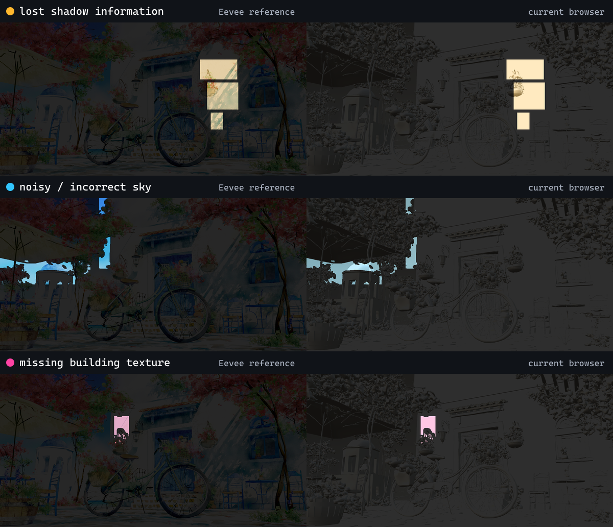
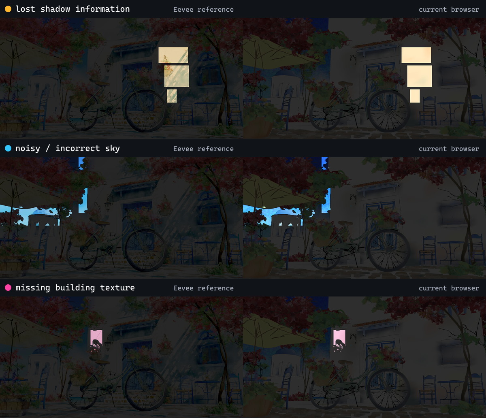

# Blender 4 Splash material factorization and Needle differential, 2026

Research date: 2026-07-24

## Decision

The Blender 4 Splash failure is not an image-loading bug and it is not solved
by copying one more texture into the deployment. The active EEVEE surfaces are
custom stylized graphs. The dominant building graph combines two independent
vertex fields with a mapped, ramped image field and then passes the result
through EEVEE-only lighting. Neither the current Blendlink selection nor
Needle's stock-glTF export preserves that graph.

Blendlink should add a deep material-portability planner with three deliberately
different outcomes:

1. **Exact standard tuple:** recognize and preserve only expressions that are
   exactly representable as stock glTF material fields, texture transforms, and
   `COLOR_0`. This path performs no bake.
2. **Exact selected intrinsic field:** when an artist explicitly selects a
   static, lighting-independent Color/Value socket that is not factorable,
   materialize that closure transactionally per binding. For an ordinary
   surface, transport it as a **lit** stock-PBR base-color texture so the
   website's lights and shadows can still act on it. Unlit remains an explicit
   surface-response choice for sky/emissive intent.
3. **Unsupported full EEVEE appearance:** refuse any claim of exact portable
   material parity when Shader to RGB, Ambient Occlusion, cast shadows,
   view/camera coordinates, transparency, compositor output, or another
   scene/view dependency remains downstream. A fixed-camera EEVEE plate can be
   a reference or application-owned fallback, not the default 3D result.

For the inspected Splash fixture, exact no-bake factorization covers
**0/33 active authored EEVEE surfaces and 0/1,100,070 triangles**. The number is
zero for the *complete active surface*, not for every useful subexpression.
There are 92,644 triangles (8.421646%) whose primary intrinsic group input is a
direct vertex-color candidate, but every one still has downstream custom EEVEE
shading. Those candidates are useful compiler inputs; they are not evidence of
full-surface equivalence.

The smallest high-confidence improvement is therefore not an automatic
whole-surface bake. The initial audit proposed:

- an exact-tuple recognizer with a red near-miss fixture;
- a completeness diagnostic that explains what an artist's selected socket
  omits and suggests a more complete *eligible* downstream socket;
- multi-binding selected-field materialization; and
- lit stock-PBR transport plus a browser shadow differential.

This preserves EEVEE as source truth, stays within the maintainer-approved
selected-intrinsic Cycles exception, and keeps the runtime ordinary Three/glTF
instead of turning Blendlink into a shader engine.

## Production follow-up: one selected field, two stock slots

`NDL-MAT-010` now ships one deliberately narrower improvement than the
initial DPM-family proposal. A name-agnostic structural recognizer accepts
only this complete active-Surface topology:

```text
d = ColorRamp(ShaderToRGB(Diffuse))
primary = mix(I, I * (d + S), s)
Surface = Emission(primary)
```

`I` must be the exact artist-selected, statically materializable Color/Value
closure; `s` and `S` must be unlinked, unanimated unit-range constants; and the
selected field must have exactly the proved ownership inside the response
group. Any additional post transform, linked or animated parameter,
`s ∈ {0,1}`, nonportable closure, translucent/backfacing input, or extra active
Surface path refuses the specialized lowering and falls back to the existing
loud response diagnostic.

The lowering uses **one** private Cycles Emit bake of the artist-selected
field and **one** emitted PNG. Core glTF reuses that same Texture object in
both slots:

```text
baseColorFactor = (s, s, s)
emissiveFactor  = (1 - s) + s * S
```

The emissive term is the exact static shade floor. Ordinary
metallic-roughness lighting is explicitly recorded as an approximation of the
source Shader-to-RGB direct term. A proposed second compiler-derived bake was
rejected: it would widen the maintainer-approved exception beyond the selected
socket, duplicate texture payload, and add another UV/image ownership surface
without improving the exact term. No Blendlink material extension or custom
runtime shader is introduced.

Blender 5.2's stock exporter initially serialized two Texture records pointing
at the same image/sampler. Blendlink now performs one narrow, lossless
post-export normalization only after proving both TextureInfo records,
Texture records, source image, explicit sampler, texCoord, name, extras, and
extension state are equivalent. It redirects the Emission TextureInfo to the
Base Color Texture index and retains the now-unused duplicate record so no
global texture reindex is needed. Differing wrap/filter state and differing
TextureInfo extras are independent red fixtures.

Installed Three 0.184.0 `GLTFLoader` clones a Texture independently for every
nonzero `TextureInfo.texCoord` assignment, even when both slots reference one
glTF Texture index (`examples/jsm/loaders/GLTFLoader.js`, SHA-256
`97642d720f16cc9a0c9844934198e4d0c023bea8e89576d0f7545d03b2d103d2`).
Blendlink therefore rejoins only this attested material rule before prewarm:
the Base Color and Emission textures must share one decoded source and have
identical channel, sampler, color-space, transform, and upload contracts. The
cache-aware lease restores the original GLTFLoader clone on disposal and
conditionally preserves later application changes. This is a loading
normalization, not a shader extension.

The current Blender 4 Splash `DPM.002` does **not** match this family. Its one
existing marker still selects `Color Attribute.001 -> Color`; the planner now
names the unique eligible downstream candidate
`Mix.001 -> Result (Color)` and states that it will not change the artist's
selection automatically. Selecting that complete intrinsic still reaches
additional Shader-to-RGB/AO/grain response nodes, so
`recognizedStaticFloorFactorization` remains `null`. `DPM.002` also has 18
primitive bindings, which remain outside the current single-binding selected
field contract. This is an improved diagnostic, not a claim that the Splash
building is fixed.

Evidence:

- Headless Blender 5.2.0 LTS
  (`fbe6228777e7`):
  `packages/blender-addon/tests/material_compiler_check.py` proves the exact
  arbitrary-name positive, post-transform and `s=0/1` near misses, animation
  refusal, the translucent/backfacing umbrella negative, state restoration,
  one selected-field bake, exact final-GLB factors, shared image bytes,
  sampler, texCoord, UV/geometry association, and normalization refusals.
- `packages/blendlink/src/sceneDiagnostics.test.ts` independently reattests
  the final glTF-Transform `Document`: one Texture object must still be shared
  by Base Color and Emission, factors and sampler/texCoord must remain exact,
  and a byte-identical duplicate Texture object refuses.
- `npm run test:static-shade-floor-browser` loads the exact generated 9,704 B
  GLB (SHA-256
  `6a7048154b3a2914451f93d6322c1c809f7523c8f6925a837bab31491fb755e3`)
  in Chromium/WebGL 2 through Three r184. It proves the final shared glTF
  Texture index, `MeshStandardMaterial`, package-normalized
  `map === emissiveMap`, a 121,032-pixel visible light-off floor, and a
  121,032-pixel / 11.619 mean-absolute-RGB light-on direct response.
- Real diagnostic:
  [`../experiments/splash-material-response-factorization/dpm-plan-evidence.json`](../experiments/splash-material-response-factorization/dpm-plan-evidence.json)
  records the unchanged marker, named complete candidate, 18 bindings, and
  truthful specialized-factorization miss against fixture SHA-256
  `29f9d5d39c74068b48e30028b5ae7bf196b21e0f85945535636b4c3e164f6d4f`.
- A wider exact family that covers the real DPM response and the production
  Splash crop remain **Future**.

## Evidence status and scope

- **Verified source identity:** the exact Needle add-on files and exact Engine
  bundle used by the coherent official Preview browser cell are identified
  below.
- **Verified actual exports:** the selected Splash derivative was exported by
  Needle's add-on and Blendlink, and both resulting GLBs were inspected.
- **Verified browser pixels:** both candidates were evaluated against the same
  EEVEE reference and semantic masks. The visual differential has isolated
  positive and negative controls.
- **Verified graph forensics:** the active material graphs, packed images,
  material bindings, triangle coverage, and dominant building-mask ownership
  were inspected in Blender 5.2.0 LTS.
- **Shipped bounded follow-up:** the selection-completeness suggestion and
  exact one-bake shared-texture static-floor carrier described above are
  implemented and headless/final-Document/Chromium verified.
- **Still design/future:** general exact-tuple recognition, multi-binding
  intrinsic materialization, the broader DPM response, and the production
  Splash crop have not been promoted by this workstream.
- **Verified coherent Preview cell:** the uncompressed add-on export is loaded
  by a clean generated official Preview host with Engine 5.1.4 and Vite 8.0.3;
  `npm ls --all` and the named browser smoke pass.
- **Not claimed:** the licensed
  `@needle-tools/gltf-build-pipeline@3.0.0 transform` was not run. Production
  compression/progressive output remains pending, and the clean tree still
  contains project Three 0.169.21 plus Engine-nested Three 0.169.19.

The repository baseline verifier passed on 2026-07-24:

```text
BLENDLINK_NEEDLE_BASELINE_VERIFIED 122 files, 7 source version identities (2026-07-24) integration=mixed-source named=splash-official-preview:coherent
```

That command proves both the recorded per-package identities and the narrowly
scoped `integration:splash-official-preview=coherent` cell. The broad
inventory remains mixed-source; the named Preview cell does not promote
historical or production-transform paths.

## Standards boundary

The glTF 2.0 metallic-roughness contract is multiplicative. A base-color
texture is multiplied by `baseColorFactor`; when `COLOR_0` is present, it is an
additional linear multiplier. It does not provide a second independently
addressable RGB vertex field or a masked RGB mix operator.
[Khronos glTF 2.0 specification](https://registry.khronos.org/glTF/specs/2.0/glTF-2.0.html#materials)

Blender's stock glTF exporter recognizes a bounded material vocabulary centered
on Principled BSDF and unlit arrangements. Its documented base-color path uses
the Principled Base Color default or a connected Image Texture, with recognized
factor arrangements.
[Blender 5.2 glTF exporter manual](https://docs.blender.org/manual/en/5.2/addons/scene_gltf2.html#materials)

Shader to RGB is EEVEE-only and evaluates lighting on its input BSDF before
converting the result to color. A Cycles Emit bake of a selected upstream
intrinsic socket therefore cannot truthfully claim to reproduce the downstream
Shader-to-RGB surface.
[Blender EEVEE supported nodes](https://docs.blender.org/manual/uk/5.0/render/eevee/limitations/nodes_support.html#eevee-only-nodes)

These contracts establish two independent questions:

1. Can an intrinsic material field be represented exactly by stock glTF?
2. Does that field equal the final authored EEVEE surface?

For Splash, the answer to both is usually no, but for different reasons.

## Exact Needle identity and behavior

The inspected add-on is **Needle Engine Exporter for Blender 1.4.2** under:

`artifacts/release-dogfood/blender-4-splash/needle-three-way-2026/needle-user-scripts/addons/Needle Engine Exporter for Blender/`

Normalized source identities:

| Source | SHA-256 |
| --- | --- |
| `__init__.py` | `980226A628182E9E0B1D443C0E294F799162C76E06C5F599DACC20C614A8C96E` |
| `blender_export.py` | `6272997CFB4F1D740EA33A7C2512983B9993DEDF93C9C8240CA0FF7F82925D77` |
| `lightmapping/lightmapping.py` | `4E69F0934D9329B2D8480B097BAA1D903AA31BED9337C7A2AE0630CBC900B4F1` |
| `extensions/NEEDLE_lightmaps.py` | `3831DD545261FDD4FA5E5FCA9AD98AE7912A0939EA2758BB737B74EAE4376A77` |

`blender_export.py` sets `export_image_format = "AUTO"` and delegates scene
serialization to `bpy.ops.export_scene.gltf`. Its lightmap system is a
different, explicit `isLightmapped` / `bakeLightmaps` route. It bakes combined
lighting to RGBM and requires `NEEDLE_lightmaps` plus Needle's runtime shader
patch; it is not an automatic custom-material graph compiler. The actual
Splash run contained zero lightmapped materials.

The clean official Preview project is:

`experiments/needle-splash-official-preview/`

The imported package is `@needle-tools/engine` **5.1.4**:

| Source | SHA-256 |
| --- | --- |
| Preview `package.json` | `C808E760808B96FC87B0FF8A2BE6B346E844A204976C16AAF85FCEDF80844EC2` |
| Preview `package-lock.json` | `A3C5B7C3102414FDC1B7D1A07859816C38525C0E1B647CE0C90341558E40D322` |
| Preview `vite.config.js` | `38831F1BB7F23B086C0F096F3DBD165B1F61E0EB8B9E1EBEB0B71AF295E9E573` |
| Engine `package.json` | `522F0A5AA64C22FE76A5D7C6FD0F039FCE396EB841324512862C0D704BCACB38` |
| Engine `lib/needle-engine.js` | `C6FEFDEDA5137B38A611C587BCA9C93F9F56068FFDF88C0D2B2D3BD0A1BAE261` |
| Vite `8.0.3` `package.json` | `A6E1E3371949BBC440444B6503C4AB206386D1ECA5CF51CAECD28283AAA0631D` |

This is exact source identity for a coherent official Preview cell. A current
`npm ls --all` in that root exits `0`. Needle's official Vite plugin and
build-info path are active, and the browser element reports Engine `5.1.4`.
The development build explicitly skips the licensed production transform, so
this is not a coherent Needle production claim. The broad source inventory
also remains `integration=mixed-source`.

## Same-scene actual-result comparison

Both candidates use:

- fixture
  `artifacts/release-dogfood/blender-4-splash/fixtures/blender-4.0-splash-selected-sky.blend`;
- fixture SHA-256
  `9F9527030372E7F478BEA487B59633AF79BE2BFAEC4B57FF945AAE56817C027A`;
- EEVEE reference
  `artifacts/release-dogfood/blender-4-splash/blender-reference-selected-sky-0001.png`;
- reference SHA-256
  `650E2F0FC9F78BBD6AEC6656D9D241B656A6ACF16C4CB10EB12CB7C8E601F243`;
- a 1200 by 600 authored-camera capture; and
- the same controlled shadow, sky, and building semantic masks.

### Emitted payload

| Result | Blendlink selected-field artifact | Needle add-on export |
| --- | ---: | ---: |
| GLB SHA-256 | `8023CC4CADA546F0B68DECD87B274118424C03A87D42D25001CAAAE1650CBBAC` | `BA66CF5C974BF5FB14740E42225DE5030174E9ECBE2731D74B7AD0FB38660DA9` |
| Materials | 33 | 36 |
| Unlit materials | 33 | 0 |
| Images / textures | 1 / 1 | 1 / 1 |
| Materials with base-color texture | 1 (`DP-SkyPaint`) | 1 (`skybox`) |
| Other authored surface textures | 0 | 0 |
| Primitives with `COLOR_0` | 334/335 | 338/339 |
| Runtime lightmapped materials | 0 | 0 |

Needle's other 35 materials are effectively untextured stock/default PBR.
Blendlink's other materials carry the artist-selected direct fields, mostly
`COLOR_0`, but transport all of them as unlit. Neither artifact contains the
packed `noiseA.jpg` through `noiseE.jpg` material contribution.

### Browser pixels

The immutable Needle browser evidence is:

- screenshot
  `experiments/needle-splash-official-preview/browser-evidence-needle-blender-4-splash-selected-sky-authored-camera-official-preview-networked.png`;
- screenshot SHA-256
  `54E30ECAA0342611122288EFBF6FFE9C7440709D6D613C67ADF77D37FE0EFCBC`;
- passed browser evidence SHA-256
  `AA6045B86588B48EA0E8153C7C440FE03A3BF3BB191BA0CA840C18B3D8BBA06C`;
- exact GLB SHA-256
  `BA66CF5C974BF5FB14740E42225DE5030174E9ECBE2731D74B7AD0FB38660DA9`;
- exact environment SHA-256
  `BDF2298244AFFA0F85509380FD130AC6D4DFAA3C856DF065998F7F4C1A93DC0D`.

The browser loaded the exact asset graph with WebGL 2, a nonzero/nonblank
canvas, no relevant page/request error, 342 runtime meshes, and no lightmaps.
That proves an actual result, not its visual correctness.





Reference-relative results:

| Semantic gate | Blendlink | Needle official Preview | Threshold | Outcome |
| --- | ---: | ---: | ---: | --- |
| Shadow broad-band ratio | 0.268233 | 1.066283 | >= 0.72 | Blendlink fails; Needle submetric passes |
| Shadow luma-range ratio | 0.154057 | 0.550198 | >= 0.72 | both fail |
| Sky local-noise ratio | 1.630712 | 1.371534 | <= 1.25 | both fail |
| Sky color error, reference spreads | 3.458311 | 5.037634 | <= 2.0 | both fail |
| Building mid-frequency detail ratio | 0.042990 | 0.879401 | >= 0.70 | Blendlink fails; Needle submetric passes |
| Building local-color detail ratio | 0.040908 | 0.925291 | >= 0.70 | Blendlink fails; Needle submetric passes |
| Building reference-pattern correlation | 0.045046 | 0.595708 | >= 0.65 | both fail |
| Building pattern error | 0.999061 | 0.852540 | <= 0.70 | both fail |

All three complete semantic gates fail for both candidates. Needle retains much
more generic building-frequency variation and some live-lighting structure,
but it still does not recover the reference pattern. Blendlink retains the
selected chroma more intentionally, but its unlit transport removes the
possibility of ordinary realtime shadow response and its selected vertex field
bypasses the packed building field.

Reproduction:

```powershell
npm.cmd run verify:needle-baseline

node artifacts/release-dogfood/blender-4-splash/needle-three-way-2026/capture.mjs `
  C:\Users\micha\Documents\GitHub\MichaelRoweJonesSite `
  "C:\Program Files\Google\Chrome\Application\chrome.exe" `
  authored-camera-official-preview-networked `
  C:\Users\micha\Documents\GitHub\blendlink\experiments\needle-splash-official-preview `
  https

node experiments/splash-visual-fidelity-differential/run.mjs `
  --candidate "experiments/needle-splash-official-preview/browser-evidence-needle-blender-4-splash-selected-sky-authored-camera-official-preview-networked.png" `
  --output "experiments/needle-splash-official-preview/visual-gates"
```

The visual command intentionally exits nonzero because the candidate fails.
Its `evidence.json` SHA-256 is
`AC538ADC31DE0A7D4446C54890CDBAA2907793484C91F112F94B2F573F0D5E9D`.

## Exact Splash graph finding

Most reached Splash materials terminate in custom node groups with outputs
named `Emission` or `Shader`, not a stock Principled surface. Their internal
shape commonly contains:

```text
intrinsic color fields
  -> Diffuse BSDF
  -> Shader to RGB
  -> ColorRamp / stylized composition
  -> active EEVEE surface
```

There are also Ambient Occlusion, procedural noise/grain, transparency, and
scene/view-dependent branches. That is why a complete active surface is not an
exact stock-glTF tuple even when one of its upstream color fields is portable.

### Dominant building material: `DPM.002`

The current Blendlink fixture marks:

```text
Color Attribute.001 ("Attribute")
```

The actual primary custom-group input is:

```text
Mix.001 Result
```

`Mix.001` is an RGBA Multiply mix:

```text
A = vertex color "Attribute"
F = independent vertex color "Color"
B = ColorRamp(Mapping(packed noiseE.jpg))

Result = A * ((1 - F) + B * F)
```

The evaluated bindings contain nonconstant values for both `A` and `F`;
`noiseE.jpg` is a packed 1000 by 1000 image; and the ColorRamp is nontrivial.
Some bindings do not carry every candidate attribute, which makes material
realization binding-specific.

The standard glTF base-color tuple is:

```text
baseColorFactor * baseColorTexture * COLOR_0
```

One `COLOR_0` cannot supply both independently varying RGB `A` and RGB mask
`F`, and its alpha cannot implement the masked RGB mix. This is an algebraic
nonfactorability result, not a claim that baking is always needed for every
Mix node. If `F` were provably one, or if one input were a constant that could
be folded into a factor/texture, an exact standard tuple could still exist.

`DPM.002` is used by 18 object/material bindings. Its 63,191 triangles are
5.744271% of the scene. A camera ray-cast through every third pixel of the
existing building mask, honoring culled backfaces, attributed:

| Hit material/object family | Sampled mask rays | Share |
| --- | ---: | ---: |
| `Cube` / `DPM.002` | 411 | 97.3934% |
| `DPM.003` | 5 | 1.1848% |
| `Bush.001` | 3 | 0.7109% |
| `Bush.006` | 3 | 0.7109% |

The missing-building-pattern gate is therefore overwhelmingly observing the
skipped `DPM.002` masked image field. It is not evidence of a failed texture
request or GPU upload, because the texture never enters either GLB.

### Packed-image contribution coverage

Eleven used source materials have active packed-image contributions:

| Material | Triangles |
| --- | ---: |
| `DPM.002` | 63,191 |
| `DPM.006` | 30,466 |
| `roof.001` | 24,254 |
| `Bush.005` | 18,624 |
| `DPM.003` | 18,387 |
| `DPM.004` | 11,564 |
| `DPM.010` | 4,942 |
| `DPM.007` | 2,070 |
| `roof` | 1,332 |
| `roof.002` | 852 |
| `DPM.011` | 544 |
| **Total** | **176,226 (16.019526%)** |

The roof families have multiple packed image/mask contributors. `Bush.005`
uses its image in a stylized shade-color path rather than as a simple albedo.
None of these eleven complete active surfaces factor exactly into one standard
base-color texture and one vertex color without baking.

### Useful intrinsic candidates are not surface parity

The following primary group inputs are direct vertex-color candidates:

| Material family | Triangles |
| --- | ---: |
| `DPM` | 48,902 |
| `Bush.005` | 18,624 |
| `DPM.001` | 18,316 |
| `DPM.005` | 3,104 |
| `plantsDPM.002` | 2,788 |
| `DPMLeaf.001` | 351 |
| `plantsDPM` | 258 |
| `DPMLeaf.004` | 147 |
| `DPMLeaf.005` | 84 |
| `plantsDPM.001` | 70 |
| **Total** | **92,644 (8.421646%)** |

The black outline selections cover another 105,170 triangles (9.560301%), but
their active outline groups also carry transparency/camera-facing behavior.
Even the combined 197,814 triangles (17.981947%) are only simple **selected
intrinsic colors**, not exact complete EEVEE surfaces.

## Design comparison

### Design A: exact standard-tuple recognizer, no bake

Normalize the reachable intrinsic expression and prove whether it factors into
stock glTF:

```text
constant factor
  * at most one sampled 2D image field (+ supported texture transform)
  * at most one vertex color field
```

It should preserve the stock exporter whenever an already-recognized
Principled/unlit graph exists and synthesize a portable stock material only
for another *proven equivalent* closure. A near miss such as masked Multiply
must stay red.

Advantages:

- exact, cheap, cacheable, and renderer-independent;
- preserves website-owned realtime lighting;
- no UV bake when the source image/UV already fits the tuple; and
- strongest developer interoperability.

Limit:

- 0% complete active-surface coverage on this Splash fixture.

**Decision:** adopt first, but never treat resemblance to a known node family
as equivalence.

### Design B: explicit selected-intrinsic materialization to lit PBR

When the selected socket is static, unit-range, lighting-independent,
view-independent, and inside the approved whitelist, evaluate its complete
upstream closure through the existing private Cycles Emit transaction. Realize
one binding-specific stock material per distinct receiver/UV/dependency
identity.

For `DPM.002`, an artist-approved selection of `Mix.001 Result` can include
`Attribute`, the independent `Color` mask, the `noiseE` mapping/ramp, and the
masked multiply. That field is an exact intrinsic result under the approved
exception. It is still not the final Shader-to-RGB/AO/shadow surface.

The resulting ordinary surface should default to lit stock PBR rather than
`KHR_materials_unlit`. This is a behavior change, so it needs an explicit
surface-response plan and browser evidence. Sky/emissive selections must be
able to remain explicitly unlit.

Advantages:

- much broader intrinsic coverage while keeping ordinary glTF at runtime;
- hides UV/materialization complexity from developers;
- preserves live application lights, shadows, LOD, interaction, and camera
  movement; and
- has no Needle selected-socket analogue in the inspected add-on.

Limits:

- the current planner refuses a selected material with more than one binding
  via `material.selected-field-binding-count`; `DPM.002` has 18;
- generated selected-field materials are currently required to be unlit;
- static graph eligibility and per-binding dependency identity must remain
  loud; and
- it cannot claim the downstream EEVEE surface.

**Decision:** recommended next implementation after the exact recognizer and
completeness diagnostic.

### Design C: EEVEE-native appearance materialization

Render the final EEVEE result into UV space or capture a fixed-camera plate.
This is the only family here that can potentially include Shader to RGB and
EEVEE-only lighting.

Advantages:

- highest potential parity for a selected view/result.

Limits:

- a general UV materializer must reconstruct position, normals, Generated/
  Object coordinates, derivatives, alpha, margins, object dependencies, and
  scene/view semantics;
- baked cast shadows and AO freeze assumptions that become wrong under
  interaction;
- a camera plate freezes the camera and stops being a general 3D scene; and
- it risks creating a second rendering system inside Blendlink.

**Decision:** retain as Prototype/Future Work for narrowly declared appearance
receivers or visual-reference capture. Do not generalize the Cycles intrinsic
exception and do not make it the default.

### Design D: translate arbitrary Blender graphs into runtime shaders

Compile node graphs to TSL/GLSL and ship a custom runtime material system.

This would make the website depend on a Blendlink shader engine, expand the
compatibility surface to EEVEE lighting semantics, and conflict with the
product boundary.

**Decision:** reject as the general solution.

## Recommended deep interface

Keep generated Blender bindings and React/Three bindings small. One compiler
module should own classification, diagnostics, planning, realization, and
attestation:

```python
@dataclass(frozen=True)
class ExactStandardTuple:
    base_color_factor: tuple[float, float, float, float]
    texture: TextureField | None
    color_attribute: str | None
    surface_response: Literal["lit", "unlit"]

@dataclass(frozen=True)
class SelectedIntrinsicTexture:
    socket_identity: SocketIdentity
    bindings: tuple[BindingMaterialization, ...]
    surface_response: Literal["lit", "unlit"]
    omitted_downstream: tuple[DependencyDiagnostic, ...]

@dataclass(frozen=True)
class UnsupportedEeveeSurface:
    blockers: tuple[DependencyDiagnostic, ...]
    eligible_suggestions: tuple[SocketIdentity, ...]

SurfacePlan = (
    ExactStandardTuple
    | SelectedIntrinsicTexture
    | UnsupportedEeveeSurface
    | RefusedSurface
)

def plan_web_surface(material, bindings, artist_intent) -> SurfacePlan: ...
def realize_web_surface(plan, transaction) -> MaterialAttestation: ...
```

This is an illustrative internal seam, not a manifest proposal. It should live
beside the current Material Compiler and delegate bake mechanics to the single
canonical `packages/blendlink/blender/bakelib.py`. It should not add a parallel
bake implementation to the add-on or site.

The UI can then present one compact artist-readable result:

```text
DPM.002 / Web Color currently selects "Attribute".

That keeps the main vertex color but omits:
  "Color" vertex mask
  noiseE.jpg -> Mapping -> Color Ramp
  Mix.001 masked Multiply

"Mix.001 Result" is eligible as a static intrinsic field.
Shader to RGB, AO, scene lighting, cast shadows, and the compositor remain
outside this materialization.
```

The artist must approve a different selection. Automatic suggestions improve
discoverability without silently widening the approved Cycles exception.

## Smallest red-capable differential

### Blender differential: exact tuple versus masked near miss

Create one minimal `.blend` with two objects sharing one source material:

- `A`: vertex color field;
- `F`: a second independently varying vertex color field;
- `B`: Image Texture through a nontrivial ColorRamp;
- result `A * ((1 - F) + B * F)`;
- different UVs/masks on the two objects; and
- the marker on the result socket.

Required red behavior before implementation:

- current planner reports `material.selected-field-binding-count`;
- an exact-tuple recognizer refuses the masked expression;
- selecting only `A` reports the omitted `F`, image/ramp, and Mix path;
- a control `factor * image * COLOR_0` is accepted without a bake.

Required green behavior after implementation:

- two binding-specific materializations are planned;
- private Cycles Emit pixels match independently computed expression probes;
- source Mesh/material/UV/renderer state and the `.blend` hash are unchanged;
- emitted PNG, UV set, sampler, color-space contract, material extras, and GLB
  bytes are attested; and
- injected failure restores all private state and retains the last good
  artifact.

### Browser differential: lit transport

Load the generated GLB with one ordinary Sun and an occluder:

- the masked texture pattern must be visible and correlate with a reference;
- the receiver must use lit stock PBR, cast/receive a measurable shadow, and
  remain nonblank;
- disabling the light must remove the lighting/shadow response while the
  intrinsic base-color pattern remains; and
- an explicit unlit control must remain invariant to the light.

This independently fails the current all-unlit transport and an incomplete
selected field. A Blender/unit seam alone cannot verify these browser claims.

### Splash dogfood after the focused fixture

Create a disposable derivative that changes only `DPM.002`'s approved selected
socket to `Mix.001 Result`. Run:

- the exact GLB image/material attestation;
- the existing building semantic gate;
- the realtime shadow gate; and
- the full authored-camera differential.

The new route should materially improve the building pattern without
pretending that one intrinsic field solves Shader-to-RGB lighting, AO, sky
noise, compositor color, or every other material family.

## Stable comparison records

These IDs are reserved by this note for integration into
[`TECHNIQUE_LEDGER.md`](TECHNIQUE_LEDGER.md). Relation, implementation, and
evidence are intentionally separate.

| ID | Capability | Relation | Implementation | Evidence |
| --- | --- | --- | --- | --- |
| NDL-MAT-007 | Automatic preservation of unsupported custom EEVEE Splash surfaces | **Match (shared gap, not a positive parity claim)**: Needle's stock-export path and Blendlink's current selected-field path both fail complete EEVEE parity, through different lossy representations | **Shipped limitation**; complete support **Future** | **Verified 2026-07-24** with Blender 5.2, Needle add-on 1.4.2, the coherent official Preview Engine 5.1.4/Vite 8.0.3 cell, immutable GLBs/screenshots, and controlled browser differential. All three complete semantic gates fail; the licensed production transform remains Pending |
| NDL-MAT-008 | Preserve lit versus deliberately unlit response for an explicitly materialized intrinsic field | **Match / scoped Improvement** against Needle's ordinary stock-PBR/unlit carrier semantics | **Shipped bounded classifier**; specialized stylized responses remain separate | Cross-reference only: the authoritative record and differential are in [`research-selected-field-surface-response-needle-2026.md`](research-selected-field-surface-response-needle-2026.md) |
| NDL-MAT-010 | Exact static shade-floor extraction from one exactly recognized selected-field response family, using one selected-field bake and one shared stock-glTF Base Color/Emission Texture | Needle has no inspected selected-socket/factorization analogue: **No analogue / scoped Improvement** | **Shipped bounded compiler/runtime carrier**; real Splash DPM family **Future** | Headless Blender exact/near-miss/muted/animated/umbrella/final-GLB gate, final glTF-Transform shared-Texture reattestation, and `npm run test:static-shade-floor-browser` pass on 2026-07-24. Chromium loads the exact 9,704 B GLB as `MeshStandardMaterial`, rejoins Three's nonzero-texCoord clones before upload, retains a 121,032-pixel light-off floor, and adds a 121,032-pixel direct response. The real `DPM.002` diagnostic correctly names `Mix.001 -> Result (Color)` but does not recognize the broader response; 18-binding support and the production Splash crop remain Pending |

The comparison must be refreshed if the Needle add-on bytes, imported Engine
bundle, Three topology, build path, or source fixture changes. A future
coherent **production** claim additionally requires the authenticated build
pipeline transform and a new named browser differential. The current
`integration:splash-official-preview=coherent` cell is deliberately limited to
the clean official Preview path.
