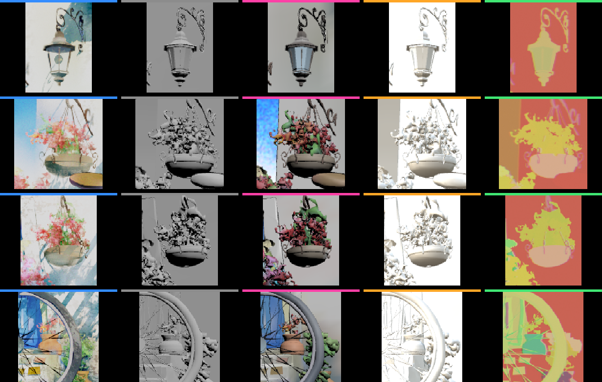
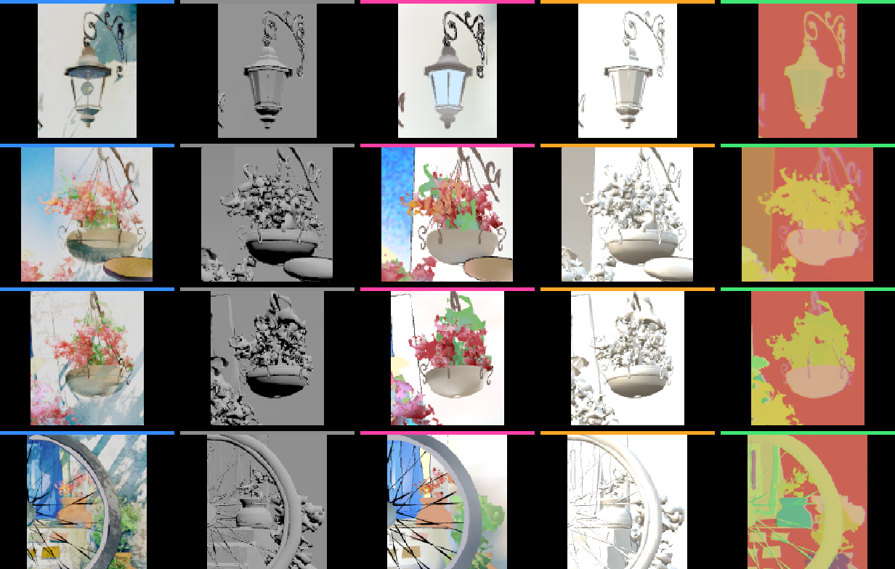

# Blender 4 Splash object completeness and opaque-alpha collapse

- Audit date: 2026-07-24
- Capability IDs: `SPLASH-OBJ-001`, `NDL-MAT-007`
- Blender: 5.2.0 LTS, build `fbe6228777e7`
- Source fixture SHA-256:
  `29f9d5d39c74068b48e30028b5ae7bf196b21e0f85945535636b4c3e164f6d4f`
- Status: direct-object structural inventory **Verified**; selected-field
  per-binding alpha classification **Shipped**; Geometry Nodes occurrence completeness
  **Future**

## Outcome

The reported doorway lamp and flowerpots are not missing from Blendlink's GLB.
Their mesh nodes, primitive indices, transforms, and opaque alpha samples are
present. They disappear visually because the selected-field compiler changes
them from opaque lit materials to unlit `alphaMode: BLEND` materials, even
though every emitted alpha sample is exactly `1`.

That distinction matters:

- `208 / 208` reliably source-visible, render-participating direct mesh names
  occur in both the Blendlink and Needle artifacts.
- The lamp and three flowerpot focus groups are present in both artifacts.
- The selected-field browser result collapses 30 meaningful direct objects
  below the registered contrast-retention threshold.
- A one-variable browser prototype leaves color, geometry, camera, and unlit
  shading unchanged and promotes only generated materials whose every bound
  `COLOR_0.a` sample equals `1` from transparent to opaque depth-writing
  rendering. The collapse count falls from `30` to `4`.

The experiment is retained at
[`experiments/splash-object-completeness`](../experiments/splash-object-completeness/README.md).
Its diagnostic columns are Eevee, stock Blendlink, selected-field Blendlink,
bounded Needle, and the detached source object-ID render:



The same crops after the one-variable opaque-alpha prototype are:



## Exact retained identities

| Input | Bytes | SHA-256 |
| --- | ---: | --- |
| Selected-sky source `.blend` | 33,387,129 | `9f9527030372e7f478bea487b59633af79be2bfaec4b57ff945aae56817c027a` |
| Selected-field Blendlink GLB | 39,823,320 | `5f35c83835716a735deb39512013d3ada0d720b661cda48df44bf9830ba30d20` |
| Stock/no-selected-lowering Blendlink GLB | 39,659,260 | `5f64b0689209b5defd1ad8ec38356526aad3fe88f3d0f4cda1474caa12a7647e` |
| Needle GLB | 39,759,032 | `ba66cf5c974bf5fb14740e42225de5030174e9ecbe2731d74b7ad0fb38660da9` |
| Baseline prototype browser PNG | 810,588 | `325ec62b8f59eba6004366b10a7753b1bb74dba5e7f8c7f2c19f595249380001` |
| Opaque-alpha prototype browser PNG | 831,301 | `f98284c67a038987545837c58e5a4431ee2bb717c31e1be5c51608328bc10f1f` |

The retained stock Blendlink artifact comes from the 120-frame derivative. It
has the same authored camera and material graphs, but not the selected-sky
source hash. It is a controlled pre-lowering proxy, not a byte-identical
before/after transaction. The exact-source Needle cell independently supplies
the same stock-material control.

## Needle baseline

`npm.cmd run verify:needle-baseline` passed on 2026-07-24:

```text
BLENDLINK_NEEDLE_BASELINE_VERIFIED 122 files, 7 source version identities (2026-07-24) integration=mixed-source named=splash-official-preview:coherent
```

The coherent named Splash browser cell is Needle add-on `1.4.2` plus the clean
official Preview host and exact Engine `5.1.4`. The broader inventory remains
mixed-source; this note does not promote unrelated Needle versions.

Needle add-on `1.4.2` delegates the scene to Blender's stock glTF operator in
`blender_export.py`, normalized SHA-256
`6272997cfb4f1d740ea33a7c2512983b9993dedf93c9c8240ca0ff7f82925d77`.
The call sets GLB, cameras, lights, `COMPAT` lighting, modifiers, and normal
stock-export settings; it does not implement a selected-field material
lowering or an opaque-by-accessor attestation pass.

The exact Blender 5.2 exporter alpha analysis is
`io_scene_gltf2/blender/exp/material/search_node_tree.py`, SHA-256
`0c037d078db37da3b6d65054206a9f55d19fa5f8ca6542f5add614230c39f7e9`.
Its `gather_alpha_info()` derives glTF alpha mode from the material node path.
Needle consequently retains opaque stock PBR materials for these objects.

Needle therefore preserves more object form in this scene, but not the authored
Eevee colors. The lamp and flowerpots remain mostly white/gray and the broader
Needle render still fails the registered visual-fidelity gates. This is a
useful behavior baseline, not a parity result.

## Exact focus mapping

The source-object pass identifies confidently interior authored-camera pixels.
All listed nodes occur in stock Blendlink, selected-field Blendlink, and
Needle.

| Visible part | Source object | Source materials | Source pixels | Stock retention | Selected-field retention | Needle retention | Opaque-alpha prototype |
| --- | --- | --- | ---: | ---: | ---: | ---: | ---: |
| Lamp shade/glass | `Pencil.001.GPM.meshline` | `DPMLeaf.006`, `LeafOutline` | 402 | 0.598048 | 0.231365 | 4.621720 | 2.842180 |
| Lamp frame/bracket | `Pencil.001.GPM.meshline.003` | `DPM.003`, `Outline.001` | 379 | 0.378831 | 0.029479 | 0.558070 | 1.086568 |
| Left hanging pot body | `Pencil.GPM.meshline.005` | `DPM.003`, `Outline.001` | 1,081 | 1.128052 | 0.059898 | 2.065620 | 0.383318 |
| Left hanging plant | `Icosphere.028` | `Bush.001`, `Bush.006` | 876 | 0.472623 | 0.049559 | 0.696515 | 1.570022 |
| Left hanging plant | `Icosphere.029` | `Bush.003` | 308 | 0.735400 | 0.000000 | 0.983569 | 1.234973 |
| Right hanging pot body | `Pencil.GPM.meshline.004` | `DPM.003`, `Outline.001` | 1,474 | 2.220420 | 0.078825 | 2.938263 | 2.513128 |
| Right hanging plant | `Icosphere.025` | `Bush.003` | 584 | 1.091110 | 0.145721 | 2.136188 | 1.534249 |
| Right hanging plant | `Icosphere.026` | `Bush.001`, `Bush.006` | 1,348 | 0.501262 | 0.013203 | 0.614415 | 1.418551 |
| Ground pot behind wheel | `Pencil.GPM.meshline.006` | `DPM.003`, `Outline.001` | 695 | 0.652717 | 0.347955 | 0.114693 | 1.077036 |

Retention is the median RGB code-value distance between source-object interior
pixels and a 3–6 pixel surrounding ring, divided by the same Eevee contrast.
It is a deterministic disappearance screen, not a perceptual-parity metric.
Values over `1` mean the browser result has more local contrast than Eevee,
not that its appearance is more correct.

## Exact material transition

For the lamp shade/glass:

- Stock Blendlink and Needle emit `DPMLeaf.006`, 180 vertices / 156 triangles,
  opaque, lit, no base-color texture, and white `COLOR_0`.
- Selected-field Blendlink emits
  `BLENDLINK_WEB.d93f35eea5.DPMLeaf.006`,
  `KHR_materials_unlit`, `alphaMode: BLEND`, and constant
  `COLOR_0 = [0.64448005, 0.84687572, 1, 1]`.

For the left hanging pot:

- Stock Blendlink and Needle emit `DPM.003`, 540 vertices / 1,016 triangles,
  opaque, lit, no base-color texture, and white `COLOR_0`.
- Selected-field Blendlink emits
  `BLENDLINK_WEB.039eb4a838.DPM.003`,
  `KHR_materials_unlit`, `alphaMode: BLEND`, and a varied RGB carrier whose
  alpha minimum, maximum, and mean are all exactly `1`.

Across the selected-field GLB, 29 generated `alphaMode: BLEND` materials bind
only primitives whose `COLOR_0.a` values are exactly `1`. Those 29 include
every reported lamp/flowerpot material.

The compiler source explains the result. `_generated_material()` treats every
vertex-alpha source as transparency-bearing and installs a Transparent/Mix
shader plus `DITHERED`; the generated fact then records `BLEND` whenever
`decision.alpha.kind == "vertexColor"`. This is conservative before inspecting
values, but it is wrong for the exact emitted artifact when all values are
opaque.

In Three.js, glTF `BLEND` materials enter transparent object sorting and do not
write depth by default. An alpha-one wall can therefore draw after and
overwrite an alpha-one lamp or pot. The one-variable browser result is direct
evidence for this mechanism: changing only transparent/depth-write state
restores the lamp, both hanging pots, the ground pot, and most of the other
collapsed objects.

The exact installed Three.js source is `0.184.0`;
`examples/jsm/loaders/GLTFLoader.js` SHA-256
`97642d720f16cc9a0c9844934198e4d0c023bea8e89576d0f7545d03b2d103d2`.
Its alpha-mode branch sets both `transparent = true` and `depthWrite = false`
for glTF `BLEND`, so this is source-verified behavior rather than an inference
from the screenshot.

## Completeness boundary

The direct-name result is intentionally narrower than all evaluated
occurrences:

- 262 source Mesh objects exist; 259 participate in the source render rule.
- 208 reliably object-ID-visible, render-participating direct Mesh names are
  present in both Blendlink and Needle.
- 22 Geometry Nodes emitter objects produce 247 evaluated instances.
- `flowerA.001`, `leafA`, and `leafB` live in an excluded source collection and
  appear in Eevee only as Geometry Nodes instance sources. Needle additionally
  exports those three source nodes; Blendlink does not. Needle's only other
  extra nodes are `Needle Extras` and `NEEDLE__skybox`.

The detached material-ID pass cannot uniquely assign Geometry Nodes
occurrences when their instanced source materials bypass the host material.
This audit therefore does not claim `247 / 247` occurrence parity. A future
occurrence inventory must compare evaluated source mesh identity plus world
transform and rendered visibility, not infer correctness from extra source
nodes.

## Designs compared

### 1. Runtime promotion after load

Traverse loaded meshes, aggregate every primitive using each generated
material, inspect `COLOR_0.a`, and set `transparent=false` plus
`depthWrite=true` when every alpha is one.

This is the implemented prototype because it changes one variable after
loading the exact production artifact. It proves the cause and visual benefit.
It is rejected as the production seam: every website would pay for compiler
repair, application material changes could race the traversal, and the
artifact would continue to state false transparency.

### 2. Binding-time alpha classification with attested variants

Before creating a generated material, classify every exact binding carrier as
Opaque, Mask, or Blend. Include that class in the generated-material variant
key. Emit Opaque when every selected alpha sample is one; otherwise retain the
existing conservative Blend/Mask paths. Post-export attestation must verify
the material mode and the complete bound accessor range.

This is the recommended deep module and production seam. Its interface is one
classification result plus evidence; object/material sharing, carrier
iteration, variant splitting, tolerance, and diagnostics remain inside the
compiler. Callers do not learn runtime material repair.

### 3. Post-export GLB alpha compaction

Read the final GLB, aggregate every primitive bound to a generated material,
and rewrite `alphaMode` to Opaque only when the emitted accessors prove it.

This inspects the authoritative bytes and is a useful independent attestation
oracle. As the owning implementation it would add another artifact mutation
stage and make the earlier material plan knowingly false. Prefer design 2,
then use design 3's analysis as the regression verifier.

## Required production gate

Create a minimal two-depth-plane Blender fixture:

1. an alpha-one vertex-color foreground object;
2. an alpha-one vertex-color background/wall sharing the selected-field route;
3. a second state with one alpha value below one;
4. a material-shared pair where only one binding varies alpha.

The gate must prove:

- opaque carriers compile to `OPAQUE`, retain depth writes, and render both
  depths independent of object-center sorting;
- any varying binding keeps its material `BLEND`, or receives a separate
  attested variant;
- pre- and post-optimizer accessors retain the selected alpha values;
- stock, selected-field, and browser pixels fail independently;
- the Splash object-completeness command moves its named focus from red to
  green without runtime mutation.

## Production result

`NDL-MAT-007` is now Shipped. The Blender 5.2 material-compiler fixture covers
alpha-one, varying-alpha, and shared-material bindings that require distinct
variants. Planning fingerprints include each binding's alpha mode, and the
finished GLB is re-read to attest Opaque/Mask/Blend plus complete bound alpha
evidence rather than repairing Three materials at runtime.

The retained production-diagnostic Splash GLB is
`d2d1e73c257afbf9a352b3cdf692dec468a74f2de50ba02a1b86b15556324b05`
(42,890,492 bytes). It emits all 33 selected-field carriers as `OPAQUE`, keeps
all 208 direct renderable source names, and recovers all nine named
lamp/flowerpot focus parts in Chromium. The production evidence command is:

```powershell
node experiments/splash-object-completeness/verify-production.mjs
```

That aggregate command remains intentionally red for two separate appearance
gaps: ten small/outline regions collapse versus four in the alpha-only
prototype, and the selected-sky symptom gate fails. The alpha, focus,
structure, artifact-linkage, and broad-shadow checks pass. The GLB was built
with a subsequently rejected automatic Shader-to-RGB response heuristic, so it
is valid alpha-causality evidence but not a current zero-configuration material
parity claim.
