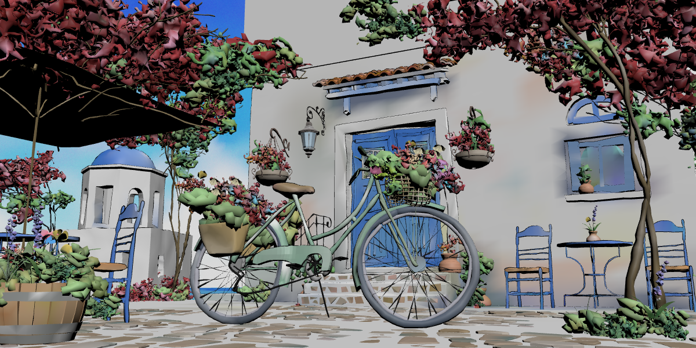

# Splash sky materialization diagnosis, 2026

- Research date: 2026-07-24
- Capability ID: `NDL-MAT-009`
- Scope: the remaining `noisy-or-incorrect-sky` failure in the exact current
  Blender 4 Splash selected-sky Final artifact
- Production changes: none
- Prototype:
  [`experiments/splash-sky-diagnosis`](../experiments/splash-sky-diagnosis/)

## Outcome

The current failure is not a missing file, incorrect glTF color-space flag,
bad CDN response, insufficient selected-field resolution, or mip bleed.
`DP-SkyPaint.MAT` deliberately combines a painted corner color with
object-space Noise and Voronoi grain, then Blender displays the result through
Filmic, `Medium High Contrast`, exposure `-0.105541`, and gamma `1.183119`.
Blendlink materializes the intrinsic field to a valid stock-glTF texture, but
two independent losses remain:

1. the website-owned renderer does not reproduce that authored Blender display
   transform; and
2. a portable Smart-UV atlas is not a pixel-equivalent representation of this
   dense object-space procedural backdrop at the authored camera.

The first loss explains most of the chromatic error. Applying the exact
authored Blender display transform to the current browser PNG reduces median
sky error from `3.475832` to `1.160241` reference spreads, but local variation
still fails at `1.963014x` the Eevee reference. The second loss is therefore
independent and remains material.

A surface-scoped, authored-camera Eevee capture is a promising bounded
fallback. The isolated sky capture passes the fixture's sky gate with
`0.318032x` reference local noise and `0.815959` reference-spread median color
error. A Chromium control projects that display-referred capture onto the one
retained `DP-SkyPaint` mesh while leaving the other 334 meshes and all geometry
identity intact. It changes one material, retains the same center raycast at
distance `619.504238`, uses one sky draw call, and has no browser errors.

This is a **Prototype Improvement** over the coherent Needle Preview for a
declared fixed camera. It is not a shipped general material translator and is
not valid after an unregistered camera, aspect, frame, or material change.



## Exact inputs

| Input | Identity |
| --- | --- |
| Selected-sky source | `artifacts/release-dogfood/blender-4-splash/fixtures/blender-4.0-splash-selected-sky.blend`; SHA-256 `29f9d5d39c74068b48e30028b5ae7bf196b21e0f85945535636b4c3e164f6d4f` |
| Current Final manifest | `artifacts/release-dogfood/blender-4-splash/src/generated/blender40SplashSelectedSky.manifest.json`; SHA-256 `bd40bd1fb604558afc921fb6a63bebc73f2759171af43d68ccc3bc317df1596e` |
| Current Final GLB | 42,890,492 bytes; SHA-256 `d2d1e73c257afbf9a352b3cdf692dec468a74f2de50ba02a1b86b15556324b05` |
| Current browser PNG | SHA-256 `af2365bb2ea08ac391548b257e44b91c4957bf228db56f469a92a3f016c1ae1a` |
| Current Eevee reference | SHA-256 `5a0fdd327fed3a718f3d0628a37e7dad6675c9ea6c98beddca799e8dc3ca770d` |
| Embedded selected-field PNG | 2,048 by 2,048, 1,277,019 bytes; SHA-256 `a62ad8c929312ba88d0e5014dade5fdc8fb1c694c6b3e1cc793714cfa69828ce` |
| Isolated authored-camera sky | 1,200 by 600; SHA-256 `5352c2e9157688c0d38e2822ccd7e43d9cc4d4c54ca9c343b7874407ab1b4871` |
| Browser differential evidence | SHA-256 `2f40073e5b20e729bb6ac19a529d1053e75a2fa714c6246bbd7bd3a2d23d687f` |

The exact Blender executable was 5.2.0 LTS, revision
`fbe6228777e7d9afefcd61a413844e790ae75db7`, with glTF generator
`Khronos glTF Blender I/O v5.2.39`.

## Source graph and receiver

The read-only Blender inventory proves:

- `Color Attribute.001.Color` enters `SkyPaint.001.A`;
- `Noise Texture.002`, scale `21.31`, is ramped and mixed at factor `0.02`;
- `Texture Coordinate.002.Object` drives `Voronoi Texture.001`, scale `6`;
- the Voronoi color is mixed at factor `0.571944`;
- Hue/Saturation/Value then feeds the active unlit Surface and the selected
  `Blendlink Web Color` marker;
- the receiver has 21,318 vertices, 21,263 polygons, 42,632 loop triangles,
  and approximately 1,200-unit bounds on every axis; and
- the source `UVMap` is degenerate/self-overlapping for this delivery.

The Final compiler therefore uses its private world-linear Smart-Project
fallback. The manifest attests UV set 1, `0.538786` covered fraction, two
bounded UV repairs, projected-density ratio `1.725147`, and
`densityMet=true`. Increasing the old Preview result to this 2,048-pixel Final
texture did not solve the gate; the retained prior differential measured
`1.845976x` local sky noise at Final versus `2.287613x` in the current
post-lighting artifact.

## glTF, color-space, sampler, and Three path

The exact current GLB contains:

- one `KHR_materials_unlit` sky carrier;
- `pbrMetallicRoughness.baseColorTexture` on `TEXCOORD_1`;
- one embedded lossless PNG whose bytes match the manifest;
- `magFilter=9729` (`LINEAR`);
- `minFilter=9987` (`LINEAR_MIPMAP_LINEAR`); and
- `wrapS=wrapT=33071` (`CLAMP_TO_EDGE`).

This matches the glTF base-color contract: base-color RGB is stored with the
sRGB transfer function and decoded to linear for rendering. See the
[glTF 2.0 specification](https://registry.khronos.org/glTF/specs/2.0/glTF-2.0.html).
The user-supplied
[Blender 5.2 glTF exporter manual](https://docs.blender.org/manual/en/5.2/addons/scene_gltf2.html)
is directly useful here: Blender exports the recognized core PBR/unlit
arrangements rather than arbitrary shader graphs, which explains both
Blendlink's explicit materialization need and Needle's empty stock material.

The browser uses Three `0.184.0`. Exact inspected sources:

| Source | SHA-256 | Relevant behavior |
| --- | --- | --- |
| `node_modules/three/examples/jsm/loaders/GLTFLoader.js` | `97642d720f16cc9a0c9844934198e4d0c023bea8e89576d0f7545d03b2d103d2` | assigns `SRGBColorSpace` to glTF base-color textures |
| `node_modules/three/src/renderers/WebGLRenderer.js` | `f42d1f7e2dddf575a2f8528fe5a561078f87eadc09ed5e805c64461b068b29de` | defaults output to sRGB; application retains tone-mapping ownership |
| `node_modules/three/src/textures/Texture.js` | `ab2b297f91c58c69a95849ef8d1d3a9b7c0e7d2c3a574964b0ffd90b107452c6` | texture/sampler state |

This also agrees with the official
[Three color-management guide](https://threejs.org/manual/en/color-management.html)
and [GLTFLoader documentation](https://threejs.org/docs/pages/GLTFLoader.html).

The filter differential rules out ordinary sampler failure:

| Browser control | Sky local noise | Median color error | PNG relation |
| --- | ---: | ---: | --- |
| Authored glTF sampler | `2.287613x` | `3.475832` spreads | baseline |
| Linear, mipmaps disabled | `2.287613x` | `3.475832` spreads | byte-identical to baseline |
| Nearest, mipmaps disabled | `2.717854x` | `3.612944` spreads | worse |

## Needle baseline

`npm.cmd run verify:needle-baseline` had already verified
`integration:splash-official-preview=coherent`. The named cell uses Needle
Blender add-on `1.4.2`, Engine `5.1.4`, Vite `8.0.3`, a clean package tree,
and the exact uncompressed stock export.

| Needle artifact | SHA-256 |
| --- | --- |
| Generated `package.json` | `c808e760808b96fc87b0ff8a2be6b346e844a204976c16aaf85fcedf80844ec2` |
| Exact lock | `a3c5b7c3102414fdc1b7d1a07859816c38525c0e1b647ce0c90341558e40d322` |
| Engine `lib/needle-engine.js` | `c6fefdeda5137b38a611c587bca9c93f9f56068ffdf88c0d2b2d3bd0a1bae261` |
| `assets/scene.glb` | `ba66cf5c974bf5fb14740e42225de5030174e9ecbe2731d74b7ad0fb38660da9` |
| Browser screenshot | `54e30ecaa0342611122288efbf6ffe9c7440709d6d613c67adf77d37fe0efcbc` |

The Needle GLB's `DP-SkyPaint.MAT` contains only `name` and `doubleSided`; it
has no base-color factor, vertex-color binding, texture, or custom shader
transport. The coherent browser therefore renders the procedural sky white
and fails the same gate at `1.371534x` noise and `5.037634` reference-spread
color error. The inspected Needle export/runtime families contain no automatic
selected-field bake or surface-scoped fixed-camera appearance transport.
`NDL-MAT-009` is therefore **No analogue / Prototype Improvement**, not a
claim about Needle's licensed production transform, which remains Pending.

## Designs compared

### A. Keep the portable atlas and reproduce the authored look

This is camera-independent, stock glTF, and preserves the website's renderer
ownership. It should remain the default portable path.

It is not sufficient for this sky. The exact authored Filmic/look/gamma
control fixes median color but still fails local variation at `1.963014x`.
Raising the atlas to 2,048 pixels and disabling mipmaps also fail. More texture
resolution or sampler knobs would spend bytes without addressing the measured
loss.

### B. Translate Blender Noise/Voronoi and its coordinate semantics to a web shader

This could remain camera-independent, but matching Blender's procedural
algorithms, node coercions, antialiasing, and version changes would create a
growing shader translator. It pushes Blendlink toward the proprietary-engine
boundary and still leaves exact OCIO display transport unresolved.

**Not recommended as the near-term fallback.** This remains Future Work unless
a much narrower standard material representation appears.

### C. Capture the selected surface through a declared fixed camera

Render only the selected material/receiver through authoritative Eevee and its
authored display transform, then project the display-referred result onto the
retained mesh at runtime with `toneMapped=false`.

This changes only the unportable surface, retains route/Canvas/renderer
ownership, keeps ordinary meshes/materials interactive, and does not pretend
the capture is portable after a camera change. The current differential proves
the sky receiver itself passes; the complete-scene sky mask remains
contaminated by foreground appearance/edge differences and therefore still
reports `1.929472x` local variation even though median sky color falls to
`0.812976` spreads. That full mask must not be cited as a complete green scene.

**Recommended as the smallest artist-friendly prototype for this fixed-camera
sky, and as a precursor to the already-proven full fixed-camera appearance
proxy when a scene needs broader Eevee fidelity.**

## Proposed contract and next differential

Do not infer this mode silently from a large sphere. Add an artist-visible
`Fixed Camera Appearance` material transport choice, recommended only when the
recipe already declares a fixed authored camera. The compiled record should
bind:

- receiver and source-material stable IDs;
- source camera stable ID plus exact view/projection matrix;
- capture resolution and aspect;
- frame/state and source hashes;
- display transform identity;
- image bytes and color-space intent; and
- a loud camera/aspect mismatch policy.

The website must continue owning its route, Canvas, renderer, and presentation.
Blendlink should install a small `toneMapped=false`, depth-testing projected
material only after validating the declared camera contract. A camera/aspect
change must fail or invoke an explicit application fallback; it must not
silently stretch the capture.

Required next gate:

1. a minimal synthetic backdrop with moving-camera negative control;
2. exact capture/artifact reattestation;
3. authored-camera browser pixels and one-mesh/material assertion;
4. camera, aspect, frame, and source-hash refusal tests;
5. depth/raycast and foreground-occlusion checks;
6. R3F/imperative lifecycle, preload, disposal, and context-loss checks; and
7. the current Splash production build/browser matrix.

The first package-owned runtime slice now passes five focused Three tests and a
generic synthetic Chrome/WebGL gate. It targets stable receiver/material IDs,
retains geometry and raycasts, validates hashes/frame/camera/aspect, refuses
complete-scene replacement, and restores owned material state:

```powershell
npx.cmd vitest run packages\blendlink\src\threeFixedCameraAppearance.test.ts
npm.cmd run test:fixed-camera-surface-browser
```

That closes the runtime-shader and moved-camera/aspect negative-control slice
only. The current manifest has no capture record, the final GLB has no
rename-stable source-material binding ID, and the compiler does not yet isolate,
capture, publish, or reattest this asset. Loading/R3F lifecycle and the
production Splash matrix are also Pending. Until those pass, `NDL-MAT-009`
remains **Prototype**; the original Splash-specific diagnostic command is:

```powershell
node experiments\splash-sky-diagnosis\run_projected_control.mjs
```
