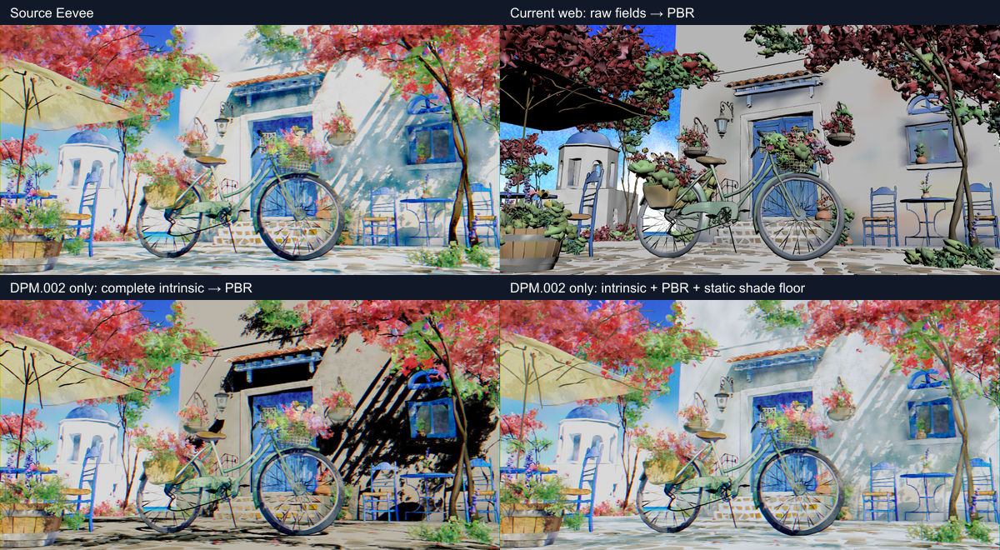

# Experiment and production follow-up — Splash intrinsic/response factorization

This experiment isolates why the current lit selected-field carrier recovers
ordinary shadows but still renders the Blender 4 Splash building incorrectly
and turns large foliage/umbrella regions nearly black.

The experiment scripts modify datablocks in memory only and never save the
source `.blend`. A deliberately narrower production carrier now ships under
`NDL-MAT-010`; it is described below and does not claim to recognize the real
Splash DPM response.

## Exact evidence

- Fixture:
  `artifacts/release-dogfood/blender-4-splash/fixtures/blender-4.0-splash-selected-sky.blend`
- Fixture SHA-256:
  `29f9d5d39c74068b48e30028b5ae7bf196b21e0f85945535636b4c3e164f6d4f`
- Blender: 5.2.0 LTS, build `fbe6228777e7`
- Current published GLB SHA-256:
  `d2d1e73c257afbf9a352b3cdf692dec468a74f2de50ba02a1b86b15556324b05`
- Current browser image SHA-256:
  `af2365bb2ea08ac391548b257e44b91c4957bf228db56f469a92a3f016c1ae1a`
- Current Eevee reference SHA-256:
  `5a0fdd327fed3a718f3d0628a37e7dad6675c9ea6c98beddca799e8dc3ca770d`

The current GLB attests `DPM.002`, `DPM.008`, `Bush.001`, `Bush.006`, and the
other automatically classified Splash materials as core lit PBR with metallic
0, roughness 0.5, and no `KHR_materials_unlit`. `DPM.002` still transports only
`Color Attribute.001` as `COLOR_0`; the packed `noiseE.jpg` field is absent.

## What the DPM graph actually does

The dominant building material `DPM.002` does not feed its selected raw vertex
color directly to a lit BSDF. Its active intrinsic group input is:

```text
A = Color Attribute.001 ("Attribute")
F = Color Attribute.002 ("Color")
B = ColorRamp(noiseE.jpg(Mapping(Object)))
I = A * ((1 - F) + B * F)              # root Mix.001 Result
```

Inside the shared DPM response group:

```text
d = ColorRamp(ShaderToRGB(Diffuse BSDF))
primary = mix(I, I * (d + ShadeColor), ShadeValue)
appearance = hueSat(grain(brightContrast(primary * coloredAO)))
```

The exact graph contains clamping and additional procedural branches; see
`graph-evidence.json`. The important algebraic facts are:

1. the current selected field is only `A`, so it cannot contain the `F/B`
   building pattern; and
2. the authored shader supplies a colored, nonzero shade floor before its
   final emission-like Surface. Replacing that with ordinary Lambert/PBR
   multiplies the color toward black in shadow, on backfaces, and under the
   umbrella.

The response group used by `DPM.002`, umbrella material `DPM.008`, and foliage
materials `Bush.001`/`Bush.006` is byte-for-byte equivalent after normalizing
datablock names. Its canonical JSON SHA-256 is
`2e405df4f836444cd9933711a56b1f91e36b42ca1f4a694b98d7379c54047a0e`.

The umbrella has an additional blocker: `DPM.008` feeds the shared group from
another `Shader to RGB` closure containing Translucent BSDF, backfacing, and a
Mix Shader. Its raw Color Attribute is neither its complete intrinsic field
nor evidence that generic opaque PBR preserves its surface response.

## Bounded differential

`render_response_variants.py` changes only `DPM.002`. All other objects and
materials stay on the authored Eevee path.

| Candidate | Shadow band / range | Building luma / color detail | Correlation | Pattern error | Result |
| --- | ---: | ---: | ---: | ---: | --- |
| Source-control repeat | 1.103 / 1.139 | 0.978 / 1.029 | 0.990 | 0.138 | Building and shadow pass |
| Pinned Needle official Preview | 1.066 / 0.550 | 0.879 / 0.925 | 0.596 | 0.853 | Shadow range and pattern fail |
| Current full web render, raw fields + PBR | 1.378 / 1.174 | 1.273 / 1.238 | 0.752 | 0.841 | Pattern error fails |
| Complete `I`, unlit | 0.682 / 0.537 | 0.807 / 0.861 | 0.857 | 0.518 | Pattern passes; shadow fails |
| Complete `I`, ordinary PBR | 2.720 / 3.329 | 1.299 / 1.363 | 0.848 | 0.696 | Pattern passes; shadows visibly overshoot to black |
| Complete `I`, PBR + exact static shade floor | 0.884 / 0.915 | 0.867 / 0.921 | 0.967 | 0.274 | Both bounded building and shadow gates pass |

The full candidates still fail the unrelated sky-noise gate. Even the unchanged
source-control repeat is 1.305× the current frozen reference on that submetric,
so this experiment makes no whole-scene parity claim.



## Design comparison

### A. Complete intrinsic field plus ordinary portable lighting

Materialize `I` per binding and publish it as core glTF base color under PBR.

This is interoperable, keeps live lights and shadows, and is already much
better than the raw field. It is still an incomplete lowering: the source has
a thresholded `Shader to RGB` ramp, a colored shade floor, AO, grain, and
translucent/backfacing branches. The actual-scene differential shows the
result can become much darker than the artist's Eevee output.

Use this only when graph proof shows the selected field feeds an ordinary
portable BSDF response. Do not infer it merely because some BSDF exists
somewhere in the active Surface closure.

### B. Complete intrinsic plus a factored static response floor

For the proven DPM family, decompose the first response stage:

```text
primary =
  I * ((1 - ShadeValue) + ShadeValue * ShadeColor)  # static floor
  + I * ShadeValue * stylizedDirectLight            # dynamic response
```

The first term is lighting-independent. Core glTF can reuse one selected-field
texture in Base Color and Emission with independent factors. The bounded
production carrier now emits one private Cycles-Emit bake of `I`, then uses:

```text
baseColorFactor = (ShadeValue, ShadeValue, ShadeValue)
emissiveFactor  = (1 - ShadeValue) + ShadeValue * ShadeColor
```

The emissive floor is exact; the browser/PBR direct response remains an
explicit approximation of the thresholded Eevee `d` term. This is stronger
than the initial two-field proposal because it stays inside the
artist-selected-socket exception, emits no compiler-derived second bake, and
does not duplicate image payload. It is intentionally recognized only for the
complete exact topology proved by the synthetic fixture.

This carrier does **not** require a Blendlink material extension or runtime
shader patch. Stock glTF 2.0 has independent `baseColorTexture` and
`emissiveTexture` slots, and Blender's stock exporter gathers both from a
recognized Principled material. They may also use distinct images and texture
coordinates, but `NDL-MAT-010` requires one shared Texture. A scalar,
precomputed occlusion field could also use
`occlusionTexture`; DPM's colored or live Eevee AO cannot. The following still
require refusal or an explicitly baked/approximated response family:

- the hard `Shader to RGB` light ramp;
- colored or dynamic AO;
- the umbrella's translucent/backfacing response; and
- view-dependent or procedural grain that is not proven static.

The stock carrier is source/spec verified, headless-Blender verified for
generated Blendlink bytes, independently reattested in the final
glTF-Transform `Document`, and browser verified by
`npm run test:static-shade-floor-browser`. The exact generated GLB loads as a
`MeshStandardMaterial`; the package rejoins Three's equivalent nonzero-texCoord
Base/Emission clones before upload, the light-off static floor remains visible,
and live light adds a measurable direct term.

This bounded lowering now ships. A closer second stage could use a
metadata-driven toon ramp only after a browser differential proves it across
WebGL/WebGPU and shadowed/backfacing controls. Do not begin an arbitrary
Blender-graph runtime.

The approach still refuses:

- `Shader to RGB`, AO, view dependence, or transparency inside the proposed
  static fields;
- the umbrella's translucent/backfacing closure until it has its own proved
  response family; and
- any material whose algebraic decomposition or binding identity is not exact.

### C. Detached final Eevee appearance

A fixed-camera Eevee plate/projector already gives the closest exact result,
but freezes camera/aspect/frame semantics. It remains valuable for an explicit
fixed-camera hero mode, not as the general material compiler.

A general Eevee UV bake is not currently evidenced: moving geometry into UV
space changes the lighting point, normals, shadows, and AO that `Shader to RGB`
evaluates. It must stay Prototype/Future until an actual per-surface
differential proves otherwise.

## Recommended product behavior

1. `surfaceResponse=auto` now keeps direct portable BSDF ownership lit and
   refuses Shader-to-RGB/AO convergence, nonportable closures, and ambiguous
   response unless a complete specialized proof exists.
2. The completeness diagnostic now recommends `Mix.001 Result (Color)` for
   `DPM.002` instead of silently treating `Color Attribute.001` as complete.
   It never changes the marker for the artist.
3. The package-owned `NDL-MAT-010` factorizer ships for one exact family and
   keeps all bake mechanics in canonical `bakelib.py`. The actual DPM response
   is broader and remains blocked.
4. Multi-binding selected-field materialization and any wider DPM-family plan
   still require an artist-approved compiler contract; developer bindings
   should remain unchanged.
5. The synthetic exact/near-miss and umbrella negative fixtures, final
   Blender/glTF-Transform byte attestation, and generated-carrier Chromium
   pixel gate pass. The real Splash building gate remains required before
   claiming DPM parity.

## Smallest production seam and differential fixture

Keep this as a package-owned compiler plan, not a developer-facing runtime
abstraction and not a manifest reshape. The initial broader design sketch was:

```python
@dataclass(frozen=True)
class StockGltfSurfacePlan:
    binding: MaterialBinding
    base_color: MaterialFieldPlan
    emissive: MaterialFieldPlan | None
    occlusion: MaterialFieldPlan | None
    surface_model: Literal["metallicRoughness", "unlit"]
    proof: FactorizationProof
    omitted_dependencies: tuple[DependencyDiagnostic, ...]
```

`MaterialFieldPlan` owns the complete closure, UV/sampler choice, color-space
contract, and per-binding identity. `FactorizationProof` records which terms
were exact and which response term is approximate. The generated GLB remains
ordinary glTF. Additive diagnostics may report
`surfaceTransport: "pbr+emissive-floor"` plus emitted image/UV/sampler hashes;
the developer's React/vanilla binding should not change.

The shipped bounded implementation uses the existing `MaterialDecision` plus a
private `SurfaceFactorization` proof instead of introducing this broader type.
That is the smaller deep seam: it produces one selected-field materialization,
generates the two stock material slots transactionally, and exposes only
additive diagnostic evidence. The broader multi-field plan remains a future
design, not an implied public interface.

Automatic mode must not silently widen an artist's selected field. For the DPM
case it should explain that the selected raw attribute is incomplete, offer
the proved `Mix.001 Result` plus shade-floor plan, list the omitted response
terms, and require artist approval. That preserves the existing narrow
compiler exception for an artist-selected intrinsic socket.

The smallest useful `.blend` differential has two objects sharing one
DPM-shaped node group but different material bindings:

```text
I = vertexA * ((1 - vertexMask) + imageRamp * vertexMask)
d = ramp(ShaderToRGB(Diffuse))
Surface = I * ((1 - s) + s * (d + shadeColor))
```

It needs these independently failing controls:

1. A positive static case produces binding-specific Base Color and Emission
   images without changing the source mesh, material, UVs, or Eevee settings.
2. A `Shader to RGB` or colored-AO dependency entering either materialized
   static field refuses factorization.
3. A DPM.008-shaped Translucent/Backfacing input refuses the ordinary PBR
   carrier.
4. GLB attestation finds core `baseColorTexture` and `emissiveTexture`, no
   custom material extension, and the exact planned image/UV/sampler hashes.
5. The generated-carrier Three.js browser gate observes an ordinary
   `MeshStandardMaterial`, normalizes GLTFLoader's equivalent nonzero-texCoord
   clones to `map === emissiveMap`, retains a nonblack light-off floor, and
   measures the live-light direct delta. The broader real-DPM crop still needs
   its own correlation/shadow gate.
6. The real Splash DPM.002 crop passes the existing building/shadow gates, and
   the umbrella remains the named negative control.

The algebra/proof unit, headless Blender materialization, GLB attestation, and
small browser fixture now pass. The real Splash differential remains the next
independent gate; the bounded carrier result must not be promoted to full-DPM
parity.

## Needle and standards baseline

The pinned Needle Blender add-on is 1.4.2. Its exact
`blender_export.py` SHA-256 is
`6272997cfb4f1d740ea33a7c2512983b9993dedf93c9c8240ca0ff7f82925d77`;
it calls Blender's stock `bpy.ops.export_scene.gltf`. The coherent official
Preview result uses Engine 5.1.4 and exports 35 untextured ordinary materials
plus one sky texture, with no receiver lightmaps. It retains generic light
frequency but loses the Splash palette and pattern. It is a behavioral floor,
not a solution to copy.

The Blender 5.2 glTF manual is directly useful here: it documents that the
exporter constructs only recognized metal/rough PBR and shadeless material
arrangements, including base, emissive, occlusion, normal, metallic, and
roughness channels. It does not claim arbitrary Eevee node compilation:

- <https://docs.blender.org/manual/en/5.2/addons/scene_gltf2.html>
- <https://registry.khronos.org/glTF/specs/2.0/glTF-2.0.html>
- <https://docs.blender.org/api/current/bpy.types.ShaderNodeShaderToRGB.html>

The last source explicitly describes Shader to RGB as converting light and
shadow to color and as Eevee-only, which is exactly the boundary exposed by
this fixture.

The installed Blender 5.2 exporter paths inspected for the stock-carrier
claim are:

| Normalized source path under `io_scene_gltf2/blender/exp/material` | SHA-256 |
| --- | --- |
| `materials.py` | `f0678496e6762566727fc9c76264c7d7665b2f22dee4671b63cfefe968ed5c31` |
| `pbr_metallic_roughness.py` | `1ecdd7caa392d58234c444a428e2c4d8d6d4b673ca9cf5630ff50c6a94a04d56` |
| `extensions/emission.py` | `0b96791c76b63a7f17b69377deeae7cfd1a3d4ad323b5ca709fcfb811e0f3ed34` |

`materials.py` gathers PBR, emissive, occlusion, and normal channels
independently. `extensions/emission.py` gathers the recognized Principled
Emission input and emits `KHR_materials_emissive_strength` only when needed.
This proves the installed exporter has the required stock serialization seam;
the proposed fixture must still prove Blendlink's generated images and a
browser loader end to end.

## Reproduction

```powershell
& 'C:\Program Files\Blender Foundation\Blender 5.2\blender.exe' `
  --background `
  'artifacts\release-dogfood\blender-4-splash\fixtures\blender-4.0-splash-selected-sky.blend' `
  --python `
  'experiments\splash-material-response-factorization\inspect_graph.py'

& 'C:\Program Files\Blender Foundation\Blender 5.2\blender.exe' `
  --background `
  'artifacts\release-dogfood\blender-4-splash\fixtures\blender-4.0-splash-selected-sky.blend' `
  --python `
  'experiments\splash-material-response-factorization\render_response_variants.py'

node experiments/splash-visual-fidelity-differential/run.mjs `
  --candidate `
  experiments/splash-material-response-factorization/output/complete-intrinsic-pbr-static-floor.png `
  --output `
  experiments/splash-material-response-factorization/output/metrics-pbr-static-floor
```

The last command intentionally exits nonzero because the whole image retains
the unrelated sky mismatch; inspect the named building and shadow subgates.
